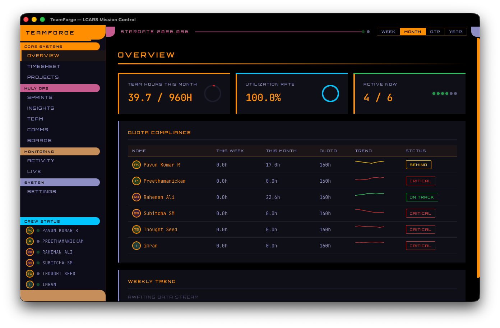
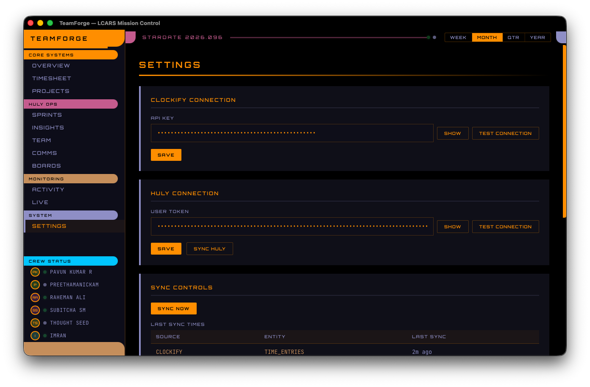
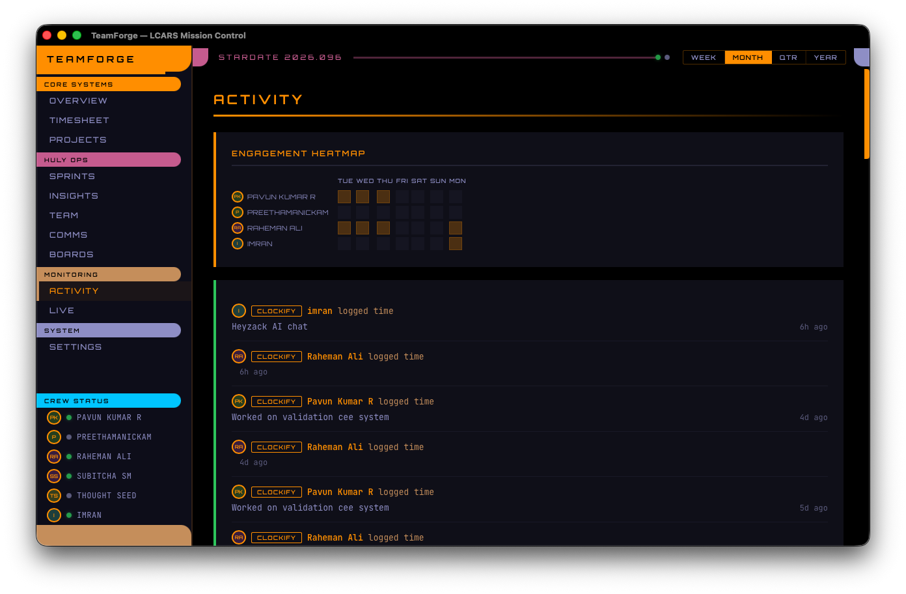
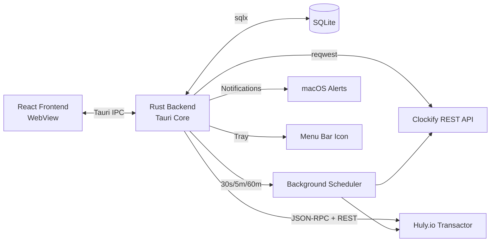
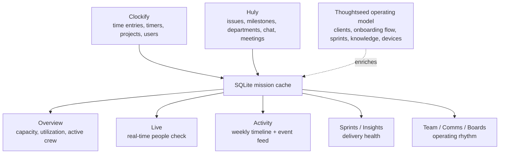

<div align="center">


```
  ____________  ___    __  ________  ____  ___  _____________
 /_  __/ __/  |/  /   / / / / __/ / / / / / _ \/ ___/ __/
  / / / _// /|_/ /   / /_/ /\ \/ /_/ / / / , _/ (_ / _/
 /_/ /___/_/  /_/    \____/___/\____/_/_/_/|_|\___/___/
       STARDATE 2026.098 — SYSTEMS NOMINAL
```

<!-- readme-gen:start:badges -->


<!-- readme-gen:end:badges -->

<!-- readme-gen:start:tech-stack -->
<p align="center">
  
</p>
<!-- readme-gen:end:tech-stack -->

</div>

---

> **Tracking your team shouldn't require switching between 6 browser tabs.** TeamForge unifies Clockify time tracking and Huly.io project management into a single native Mac applet — with a Star Trek LCARS interface that makes mission control feel like the bridge of the Enterprise.


## Highlights

<table>
<tr>
<td width="50%" valign="top">

### Unified Time Intelligence
Cross-reference Clockify hours with Huly time reports. Spot discrepancies. Track quota compliance with business-day-aware calculations.

</td>
<td width="50%" valign="top">

### Live Presence Monitoring
30-second polling shows who has active Clockify timers and recent Huly activity. Combined status: Active, Idle, Offline.

</td>
</tr>
<tr>
<td width="50%" valign="top">

### 11 Huly Integrations
Milestones, issues, HR departments, leave requests, holidays, chat activity, board cards, calendar events — all queryable via pure Rust HTTP client.

</td>
<td width="50%" valign="top">

### App-Wide LCARS Console System
The bridge look now runs across the full shell and major dashboard views with shared rails, section bands, segmented controls, and responsive console panels.

</td>
</tr>
<tr>
<td width="50%" valign="top">

### Weekly Timeline
Activity now rolls up into a compact 7-day timeline so you can read motion at the team level before diving into the raw feed.

</td>
<td width="50%" valign="top">

### Calendar Ops Route
Leave tracking and yearly holidays now live on a dedicated Calendar route, keeping schedule operations separate from org editing while still using the same cache-first Huly snapshot.

</td>
</tr>
</table>


## New In v0.1.6

- **Team is now people-first again** with org mapping, department structure, and an employee-specific operations summary instead of mixing in calendar admin.
- **Calendar is now its own route** for local leave tracking, yearly holiday management, and the shared cache-first Team schedule data.
- **Employee drill-down now shows ops context** including standups, leave status, work hours, meetings, and upcoming schedule from the merged Team snapshot + live service data.
- **Team snapshot loading is cache-first** so SQLite-backed data renders first, then refreshes live Huly state in the background.
- **Tagged GitHub releases now drive macOS packaging** so `v*` tags cut Apple Silicon + Intel Tauri release builds for the repo release page.


## Preview

### Overview



### Settings



### Activity




## Quick Start

```bash
git clone https://github.com/Sheshiyer/team-forge-ts.git
cd team-forge-ts
pnpm install
cargo tauri dev
```

**Prerequisites:** Node.js 20+, Rust 1.75+, pnpm

On first launch:
1. Navigate to **Settings** (or `Cmd+=`)
2. Enter your **Clockify API key** and select workspace
3. Confirm or edit the **Ignored Clockify Emails** list
4. Enter your **Huly JWT token**
5. Paste the **Slack Bot User OAuth Token** (`xoxb-...`) if you want Slack-backed chat activity in **Comms**
6. Hit **Sync Now** — data populates across all views
7. Open **Team** for org mapping and employee summaries, then **Calendar** for leave and holiday operations

## Releases

- **Latest tag:** `v0.1.6`
- **Release trigger:** pushing a tag that matches `v*`
- **Artifacts:** macOS `.app` and `.dmg` bundles built by GitHub Actions for Apple Silicon and Intel targets
- **Download page:** [GitHub Releases](https://github.com/Sheshiyer/team-forge-ts/releases)

## Architecture

<!-- readme-gen:start:architecture -->

<!-- readme-gen:end:architecture -->

## Thoughtseed Data Flow

TeamForge becomes useful when it does more than just display API responses. The real value is in **cross-populating three layers of truth**:

1. **Clockify** answers who is working, for how long, and whether they are active right now.
2. **Huly** answers what the work is, why it matters, what changed, and who is blocked.
3. **Thoughtseed operating structure** answers how the work should be interpreted: client, project stream, sprint, onboarding flow, knowledge asset, and delivery rhythm.



### Cross-Population Strategy

- **People layer:** map Clockify users and Huly persons into one employee record so presence, work logs, and Huly activity can sit on the same card.
- **Time layer:** let Clockify remain the source of actual effort while Huly remains the source of task semantics and collaboration context.
- **Meaning layer:** enrich raw operational data with Thoughtseed concepts such as Axtech vs Tuya vs OASIS, client onboarding flow, knowledge article lineage, and sprint rhythm.
- **Fallback ops layer:** keep local SQLite-backed leave and holiday overrides available so the Team page still works when Huly HR coverage is incomplete or a manual correction is needed.
- **Dashboard layer:** expose the fused dataset differently by page, rather than trying to force every concept into one giant table.

### How This Maps Onto The Current Dashboard

- **Overview** should answer: Are we staffed correctly? Are people active? Are hours landing where they should?
- **Live** should answer: Who is actually moving right now?
- **Activity** should answer: What changed this week, and what is the shape of team motion over time?
- **Sprints / Insights** should answer: Are delivery promises, estimates, and priorities converging?
- **Team / Comms / Boards** should answer: Is the organization functioning, talking, and unblocking itself?

This is the intended direction for the Thoughtseed workspace normalization work tracked in the repository backlog.

## System Design

The rollout is now documented in-repo instead of living only in chat and GitHub issues:

- [Changelog](CHANGELOG.md)
- [Thoughtseed Huly System Design](docs/huly-system-design.md)
- [Huly Rollout Implementation Plan](docs/plans/2026-04-06-huly-rollout.md)

## Dashboard Views

| View | Shortcut | Source | What It Shows |
|:-----|:--------:|:------:|:--------------|
| **Overview** | `Cmd+1` | Clockify | Quota compliance, team hours, utilization rate, metric cards |
| **Timesheet** | `Cmd+2` | Clockify | Time entries with employee/date filtering, CSV export |
| **Projects** | `Cmd+3` | Clockify | Per-project breakdown, utilization bars, CSV export |
| **Sprints** | `Cmd+4` | Huly | Milestone tracking, progress bars, on-track/delayed status |
| **Insights** | `Cmd+5` | Both | Time discrepancies, estimation accuracy, priority queue health |
| **Team** | `Cmd+6` | Huly + SQLite | Drag-and-drop org chart mapping, department structure, and employee operations summaries |
| **Calendar** | `Cmd+7` | Huly + SQLite | Local leave tracking, yearly holiday management, and cache-first schedule ops |
| **Comms** | `Cmd+8` | Huly + Slack | Chat activity volume, meeting load with ratio analysis |
| **Boards** | `Cmd+9` | Huly | Kanban cards, days-in-status tracking, stuck card filtering |
| **Activity** | `Cmd+0` | Both | Weekly timeline, combined feed, engagement heatmap |
| **Live** | `Cmd+-` | Both | Real-time presence cards with auto-refresh |

## Project Structure

<!-- readme-gen:start:tree -->
```
team-forge-ts/
  DESIGN.md                    # Linear design system reference
  src/                         # React frontend
    components/ui/             # Avatar, Skeleton, DateRangePicker
    pages/                     # 12 app pages including Team + Calendar split
    hooks/                     # Typed Tauri invoke layer + viewport helpers
    stores/appStore.ts         # Zustand state
    lib/                       # Types, formatting, CSV export, shared LCARS page styles
  src-tauri/                   # Rust backend
    src/clockify/              # HTTP client, sync, rate limiter
    src/huly/                  # REST client, types, sync
    src/commands/              # Tauri command surface
    src/sync/                  # Background scheduler, alerts
    src/db/                    # SQLite models, queries, migrations
    migrations/                # SQLite schema, including local Team calendar storage
  sidecar/                     # Node.js Huly SDK (reserved)
```
<!-- readme-gen:end:tree -->

## Huly Integration Details

TeamForge connects to Huly via **direct REST API calls** (no SDK required). We reverse-engineered the endpoint structure from the official `@hcengineering/api-client` source:

1. Fetch `huly.app/config.json` for accounts URL
2. JSON-RPC `selectWorkspace` call with JWT token
3. REST queries to transactor: `GET /api/v1/find-all/{workspace}?class=...`

| Huly Class | Integration |
|:-----------|:------------|
| `tracker:class:Issue` | Issue tracking, priority distribution, estimation accuracy |
| `tracker:class:Milestone` | Sprint/milestone progress |
| `tracker:class:TimeSpendReport` | Time logging cross-reference with Clockify |
| `hr:class:Department` | Organization structure |
| `hr:class:Request` | Leave/PTO tracking |
| `hr:class:Holiday` | Company holiday calendar |
| `chunter:class:ChunterMessage` | Chat activity metrics |
| `board:class:Card` | Kanban board card tracking |
| `calendar:class:Event` | Meeting load analysis |

## Sync Strategy

| Data | Source | Frequency |
|:-----|:------:|:---------:|
| Active timers | Clockify | 30s |
| Time entries | Clockify | 5 min |
| Summary reports | Clockify | 15 min |
| Users/Projects | Clockify | 60 min |
| Huly issues | Huly | 5 min |
| Huly presence | Huly | 60s |

SQLite is the single source of truth. Frontend reads cached data via Tauri IPC — never calls APIs directly.

Menu bar quick actions:
- **Show TeamForge** brings the app to the front
- **Live Crew Check** jumps straight to the real-time presence view
- **Weekly Timeline** jumps to the last-7-days activity view
- **Sync Now** runs a manual sync sweep

<!-- readme-gen:start:health -->
## Project Health

| Category | Status | Score |
|:---------|:------:|------:|
| Type Safety | ████████████████████ | 100% |
| Build | ████████████████████ | 100% |
| Architecture | ██████████████████░░ | 90% |
| Documentation | ████████████████░░░░ | 80% |
| Tests | ████████░░░░░░░░░░░░ | 40% |

> **Overall: 82%** — Operational
<!-- readme-gen:end:health -->


## Contributing

Contributions welcome. Please open an issue first to discuss what you'd like to change.

```bash
# Development
pnpm install
cargo tauri dev

# Build for production
cargo tauri build
```

## License

ISC

<!-- readme-gen:start:footer -->
<div align="center">


**Built by [Thoughtseed](https://thoughtseed.com) | Powered by Clockify + Huly.io**

</div>
<!-- readme-gen:end:footer -->
