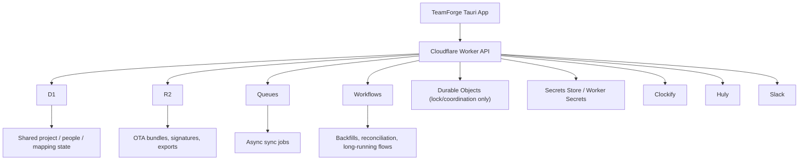

# TeamForge Cloudflare Backend And OTA Design

## 1. Discovery Summary

- Planning depth: deeply detailed
- Delivery mode: production
- Release model: phased rollout
- CI/CD expectation: production-grade
- Quality bar:
  - testing: contract tests, integration tests, release smoke tests, OTA canary validation
  - observability: request logs, sync run logs, queue/job telemetry, OTA install events
  - performance: low-latency read APIs at edge, async vendor sync off request path
  - security: vendor tokens never live on desktop clients, secrets centralized, signed OTA only
  - rollback: binary rollback via previous OTA release, backend cutover via feature flags and staged routing
- Team and agent topology:
  - human team shape: solo / small squad
  - available coding agents: Codex now; backend/cloud and validation roles can be delegated later
  - primary planner/orchestrator agent: Codex
  - default ownership split:
    - Planner / orchestrator: Codex
    - UI / app implementation: Codex
    - Cloud / backend: future backend/cloud execution lane
    - Validation: future validation lane
- Repo / delivery constraints:
  - repo scope: single Tauri app with Rust backend and React frontend
  - current persistence: local SQLite
  - target platform: macOS first, Tauri v2
  - sensitive lock zones: [package.json](/Volumes/madara/2026/twc-vault/01-Projects/thoughtseed/team-forge-ts/package.json), [src-tauri/Cargo.toml](/Volumes/madara/2026/twc-vault/01-Projects/thoughtseed/team-forge-ts/src-tauri/Cargo.toml), [src-tauri/tauri.conf.json](/Volumes/madara/2026/twc-vault/01-Projects/thoughtseed/team-forge-ts/src-tauri/tauri.conf.json), [src-tauri/src/lib.rs](/Volumes/madara/2026/twc-vault/01-Projects/thoughtseed/team-forge-ts/src-tauri/src/lib.rs)
- Confirmed inputs:
  - current app still uses direct Clockify, Huly, and Slack integrations from the desktop app
  - updater plugin is not configured yet
  - Huly write-paths and normalization are only partially surfaced in the current product
- Assumptions made:
  - one TeamForge workspace will initially own one shared Clockify workspace, one Huly workspace, and one Slack app
  - the first Cloudflare rollout should preserve offline-friendly local caching
  - the first OTA rollout should target macOS Apple Silicon first
- Unresolved questions:
  - whether authentication should start as a shared admin token or jump straight to user/device identity
  - whether per-client / per-project vendor credentials are needed in the first release
  - whether Huly remains the operational source of truth for HR objects or TeamForge takes ownership

## 2. Context Sources Loaded

- [docs/huly-system-design.md](/Volumes/madara/2026/twc-vault/01-Projects/thoughtseed/team-forge-ts/docs/huly-system-design.md)
- [docs/plans/2026-04-06-huly-rollout.md](/Volumes/madara/2026/twc-vault/01-Projects/thoughtseed/team-forge-ts/docs/plans/2026-04-06-huly-rollout.md)
- [docs/runbooks/huly-workspace-normalization.md](/Volumes/madara/2026/twc-vault/01-Projects/thoughtseed/team-forge-ts/docs/runbooks/huly-workspace-normalization.md)
- [docs/architecture/contracts/README.md](/Volumes/madara/2026/twc-vault/01-Projects/thoughtseed/team-forge-ts/docs/architecture/contracts/README.md)
- [src-tauri/src/lib.rs](/Volumes/madara/2026/twc-vault/01-Projects/thoughtseed/team-forge-ts/src-tauri/src/lib.rs)
- [src-tauri/Cargo.toml](/Volumes/madara/2026/twc-vault/01-Projects/thoughtseed/team-forge-ts/src-tauri/Cargo.toml)
- [src-tauri/tauri.conf.json](/Volumes/madara/2026/twc-vault/01-Projects/thoughtseed/team-forge-ts/src-tauri/tauri.conf.json)
- Swarm Architect operating inputs from:
  - `playbooks/multi-agent-boundaries.md`
  - `playbooks/worktree-strategy.md`
  - `playbooks/verification-gates.md`
  - `playbooks/github-sync.md`
  - `templates/discovery-template.md`
  - `templates/phase-wave-swarm-template.md`
  - `schemas/task-schema.json`
  - `schemas/agent-role-matrix.yaml`
  - `schemas/runtime-role-catalog.yaml`
  - `runbooks/spec-to-plan.md`

## 3. Assumptions And Constraints

- Assumption A: TeamForge should stop storing vendor API tokens on every desktop client.
- Assumption B: TeamForge should remain usable with cached data when the Worker is unreachable.
- Assumption C: project and people mappings will become shared team state instead of machine-local state.
- Constraint A: Tauri OTA requires signed updater artifacts and cannot be treated as hot-code push for Rust code.
- Constraint B: the current app has direct local SQLite reads everywhere, so migration must be staged.
- Constraint C: Huly normalization and write-paths already exist in partial form and should be preserved, not replaced.
- Constraint D: Cloudflare Secrets Store is suitable for a small number of shared secrets, but not as a high-cardinality tenant vault.

## 3.1 Phase 1 Contract Pack

Phase 1 is implemented in the following contract artifacts:

- [README.md](/Volumes/madara/2026/twc-vault/01-Projects/thoughtseed/team-forge-ts/docs/architecture/contracts/README.md)
- [phase1-baseline.md](/Volumes/madara/2026/twc-vault/01-Projects/thoughtseed/team-forge-ts/docs/architecture/contracts/phase1-baseline.md)
- [secrets-auth-contract.md](/Volumes/madara/2026/twc-vault/01-Projects/thoughtseed/team-forge-ts/docs/architecture/contracts/secrets-auth-contract.md)
- [d1-schema-contract.md](/Volumes/madara/2026/twc-vault/01-Projects/thoughtseed/team-forge-ts/docs/architecture/contracts/d1-schema-contract.md)
- [worker-route-contract.md](/Volumes/madara/2026/twc-vault/01-Projects/thoughtseed/team-forge-ts/docs/architecture/contracts/worker-route-contract.md)
- [ota-updater-contract.md](/Volumes/madara/2026/twc-vault/01-Projects/thoughtseed/team-forge-ts/docs/architecture/contracts/ota-updater-contract.md)
- [migration-rollback-contract.md](/Volumes/madara/2026/twc-vault/01-Projects/thoughtseed/team-forge-ts/docs/architecture/contracts/migration-rollback-contract.md)

## 4. Agent Ownership Model

| Concern | Primary owner | Secondary reviewer | Notes |
|---|---|---|---|
| Planning / orchestration | planner-orchestrator | human lead | Defines contracts, rollout, and wave boundaries |
| UI / app integration | frontend-executor | planner-orchestrator | Owns Tauri updater UX and client/server cutover |
| Cloud / backend / infra | backend-infra-executor | planner-orchestrator | Owns Worker, D1, R2, Queues, Workflows, DO lock logic |
| Testing / adversarial validation | validation-reviewer | planner-orchestrator | Owns OTA, migration, sync regression evidence |
| Release integration | release-integrator | planner-orchestrator | Owns staged rollout and fallback gates |

## 5. Recommended Architecture

### 5.1 Target Shape



### 5.2 Core Decision

The correct middle layer is:

- one public Edge API Worker as the desktop app's remote backend
- D1 as the canonical shared relational data store
- R2 for updater artifacts, signatures, exports, and bulky sync snapshots
- Queues for retryable ingestion and reconciliation jobs
- Workflows for long-running orchestration
- Durable Objects only for serialization and mutation locks

Durable Objects should not be the primary database for TeamForge. They are the correct tool for:

- one workspace sync at a time
- one normalization apply flow at a time
- one OTA rollout coordinator per release channel if needed

## 6. Exact Secret Layout

### 6.1 Cloudflare Secrets Store

Use Secrets Store for the low-cardinality shared secrets:

- `TF_CLOCKIFY_API_TOKEN_GLOBAL`
- `TF_HULY_USER_TOKEN_GLOBAL`
- `TF_SLACK_BOT_TOKEN_GLOBAL`
- `TF_CREDENTIAL_ENVELOPE_KEY`
- `TF_WEBHOOK_HMAC_SECRET`
- `TF_RELEASE_PUBLISH_TOKEN`

### 6.2 Worker-Local Non-Secret Config

Use Worker environment variables / bindings for:

- `TF_ENV`
- `TF_API_BASE_URL`
- `TF_DEFAULT_OTA_CHANNEL`
- `TF_ACCESS_AUDIENCE`
- `TEAMFORGE_DB` (D1 binding)
- `TEAMFORGE_ARTIFACTS` (R2 binding)
- `SYNC_QUEUE` (Queue binding)
- `WORKSPACE_LOCKS` (Durable Object namespace)

### 6.3 Secrets That Must Not Live In Cloudflare Worker Runtime

Keep these in CI/CD secret management, not Worker runtime:

- `TAURI_SIGNING_PRIVATE_KEY`
- `TAURI_SIGNING_PRIVATE_KEY_PASSWORD`
- Apple code signing / notarization credentials

Reason: the Worker should serve updater manifests and artifacts, not have the power to mint new signed desktop binaries.

### 6.4 Credential Strategy

Phase 1:

- one shared credential set per upstream integration, stored in Secrets Store

Phase 2+:

- if per-workspace or per-customer credentials are needed, store encrypted credential blobs in D1 using `TF_CREDENTIAL_ENVELOPE_KEY`
- do not create one Cloudflare secret per tenant/project at scale

## 7. D1 Schema

### 7.1 Canonical Tables

| Table | Purpose |
|---|---|
| `organizations` | top-level tenant / account |
| `workspaces` | one TeamForge workspace mapped to upstream integrations |
| `devices` | desktop installs / device registrations |
| `employees` | canonical people records |
| `employee_external_ids` | Clockify / Huly / Slack identity mapping |
| `projects` | canonical project records |
| `project_external_ids` | Huly / Clockify project mapping |
| `integration_connections` | connection metadata, health, owner, mode |
| `integration_credentials` | encrypted credential payloads when shared global secrets are not enough |
| `sync_cursors` | per-integration cursor state |
| `sync_jobs` | enqueued sync jobs |
| `sync_runs` | execution history and status |
| `workspace_normalization_actions` | preview/apply reports for Huly normalization |
| `manual_leave_entries` | transitional writeback-owned leave records |
| `manual_holidays` | transitional writeback-owned holiday records |
| `remote_config` | feature flags and rollout settings |
| `ota_channels` | stable/beta/canary channels |
| `ota_releases` | release metadata and artifact pointers |
| `ota_install_events` | update attempts, completions, failures |
| `audit_events` | security and admin audit log |

### 7.2 Recommended DDL Skeleton

```sql
CREATE TABLE organizations (
  id TEXT PRIMARY KEY,
  slug TEXT NOT NULL UNIQUE,
  name TEXT NOT NULL,
  created_at TEXT NOT NULL,
  updated_at TEXT NOT NULL
);

CREATE TABLE workspaces (
  id TEXT PRIMARY KEY,
  organization_id TEXT NOT NULL,
  slug TEXT NOT NULL UNIQUE,
  name TEXT NOT NULL,
  clockify_workspace_id TEXT,
  huly_workspace_id TEXT,
  slack_team_id TEXT,
  mode TEXT NOT NULL DEFAULT 'shadow',
  created_at TEXT NOT NULL,
  updated_at TEXT NOT NULL
);

CREATE TABLE employees (
  id TEXT PRIMARY KEY,
  workspace_id TEXT NOT NULL,
  display_name TEXT NOT NULL,
  email TEXT,
  avatar_url TEXT,
  is_active INTEGER NOT NULL DEFAULT 1,
  monthly_quota_hours REAL NOT NULL DEFAULT 160,
  created_at TEXT NOT NULL,
  updated_at TEXT NOT NULL
);

CREATE TABLE employee_external_ids (
  id TEXT PRIMARY KEY,
  employee_id TEXT NOT NULL,
  source TEXT NOT NULL,
  external_id TEXT NOT NULL,
  external_secondary_id TEXT,
  UNIQUE(source, external_id)
);

CREATE TABLE projects (
  id TEXT PRIMARY KEY,
  workspace_id TEXT NOT NULL,
  name TEXT NOT NULL,
  code TEXT,
  project_type TEXT,
  status TEXT NOT NULL DEFAULT 'active',
  created_at TEXT NOT NULL,
  updated_at TEXT NOT NULL
);

CREATE TABLE project_external_ids (
  id TEXT PRIMARY KEY,
  project_id TEXT NOT NULL,
  source TEXT NOT NULL,
  external_id TEXT NOT NULL,
  UNIQUE(source, external_id)
);

CREATE TABLE integration_connections (
  id TEXT PRIMARY KEY,
  workspace_id TEXT NOT NULL,
  source TEXT NOT NULL,
  credential_mode TEXT NOT NULL,
  secret_ref TEXT,
  status TEXT NOT NULL,
  last_tested_at TEXT,
  last_error TEXT,
  metadata_json TEXT,
  created_at TEXT NOT NULL,
  updated_at TEXT NOT NULL,
  UNIQUE(workspace_id, source)
);

CREATE TABLE integration_credentials (
  id TEXT PRIMARY KEY,
  workspace_id TEXT NOT NULL,
  source TEXT NOT NULL,
  encrypted_payload TEXT NOT NULL,
  key_version TEXT NOT NULL,
  created_at TEXT NOT NULL,
  updated_at TEXT NOT NULL,
  UNIQUE(workspace_id, source)
);

CREATE TABLE sync_cursors (
  id TEXT PRIMARY KEY,
  workspace_id TEXT NOT NULL,
  source TEXT NOT NULL,
  entity TEXT NOT NULL,
  cursor_value TEXT,
  updated_at TEXT NOT NULL,
  UNIQUE(workspace_id, source, entity)
);

CREATE TABLE sync_jobs (
  id TEXT PRIMARY KEY,
  workspace_id TEXT NOT NULL,
  source TEXT NOT NULL,
  job_type TEXT NOT NULL,
  requested_by TEXT,
  payload_json TEXT,
  status TEXT NOT NULL,
  created_at TEXT NOT NULL,
  updated_at TEXT NOT NULL
);

CREATE TABLE sync_runs (
  id TEXT PRIMARY KEY,
  sync_job_id TEXT,
  workspace_id TEXT NOT NULL,
  source TEXT NOT NULL,
  entity TEXT NOT NULL,
  status TEXT NOT NULL,
  stats_json TEXT,
  error_text TEXT,
  started_at TEXT NOT NULL,
  finished_at TEXT
);

CREATE TABLE workspace_normalization_actions (
  id TEXT PRIMARY KEY,
  workspace_id TEXT NOT NULL,
  run_id TEXT NOT NULL,
  action_type TEXT NOT NULL,
  safe_to_apply INTEGER NOT NULL,
  applied INTEGER NOT NULL DEFAULT 0,
  status TEXT NOT NULL,
  input_json TEXT NOT NULL,
  output_json TEXT,
  created_at TEXT NOT NULL
);

CREATE TABLE remote_config (
  id TEXT PRIMARY KEY,
  workspace_id TEXT,
  config_key TEXT NOT NULL,
  config_value_json TEXT NOT NULL,
  channel TEXT,
  created_at TEXT NOT NULL,
  updated_at TEXT NOT NULL
);

CREATE TABLE ota_channels (
  id TEXT PRIMARY KEY,
  name TEXT NOT NULL UNIQUE,
  description TEXT,
  created_at TEXT NOT NULL
);

CREATE TABLE ota_releases (
  id TEXT PRIMARY KEY,
  version TEXT NOT NULL,
  channel TEXT NOT NULL,
  platform TEXT NOT NULL,
  arch TEXT NOT NULL,
  artifact_url TEXT NOT NULL,
  signature TEXT NOT NULL,
  notes TEXT,
  pub_date TEXT NOT NULL,
  rollout_percent INTEGER NOT NULL DEFAULT 100,
  status TEXT NOT NULL,
  UNIQUE(version, channel, platform, arch)
);

CREATE TABLE ota_install_events (
  id TEXT PRIMARY KEY,
  device_id TEXT NOT NULL,
  version_from TEXT NOT NULL,
  version_to TEXT NOT NULL,
  channel TEXT NOT NULL,
  status TEXT NOT NULL,
  details_json TEXT,
  created_at TEXT NOT NULL
);

CREATE TABLE audit_events (
  id TEXT PRIMARY KEY,
  workspace_id TEXT,
  actor_id TEXT,
  event_type TEXT NOT NULL,
  target_type TEXT,
  target_id TEXT,
  payload_json TEXT,
  created_at TEXT NOT NULL
);
```

### 7.3 Indexes

Required indexes:

- `employees(workspace_id, is_active)`
- `employee_external_ids(source, external_id)`
- `projects(workspace_id, status)`
- `project_external_ids(source, external_id)`
- `sync_jobs(workspace_id, source, status, created_at)`
- `sync_runs(workspace_id, source, started_at)`
- `ota_releases(channel, platform, arch, status, pub_date)`
- `audit_events(workspace_id, created_at)`

## 8. R2 Layout

### 8.1 Buckets

- `teamforge-artifacts`
- optional future split:
  - `teamforge-updates`
  - `teamforge-exports`

### 8.2 Object Keys

```text
ota/releases/0.2.0/darwin-aarch64/TeamForge.app.tar.gz
ota/releases/0.2.0/darwin-aarch64/TeamForge.app.tar.gz.sig
ota/releases/0.2.0/darwin-aarch64/release-notes.md
ota/manifests/stable/darwin-aarch64.json
ota/manifests/beta/darwin-aarch64.json
sync-snapshots/{workspace_id}/{run_id}.json.gz
exports/{workspace_id}/{export_id}.zip
```

## 9. Worker Route Contract

### 9.1 Auth And Session

Phase 1 minimal:

- desktop app authenticates to the Worker using a workspace-scoped bearer token or device bootstrap token

Phase 2 preferred:

- issue device sessions from Worker
- attach `device_id`, `workspace_id`, `channel`, and `role`

### 9.2 Public Routes For The App

| Method | Route | Purpose |
|---|---|---|
| `GET` | `/v1/bootstrap` | app bootstrap payload: workspace, feature flags, channel, server version |
| `GET` | `/v1/remote-config` | remote config and rollout flags |
| `GET` | `/v1/projects` | canonical project list |
| `PUT` | `/v1/projects/:projectId` | project metadata update |
| `GET` | `/v1/project-mappings` | Clockify/Huly mapping state |
| `PUT` | `/v1/project-mappings/:projectId` | upsert mapping |
| `POST` | `/v1/connections/:source/test` | validate Clockify/Huly/Slack connection |
| `GET` | `/v1/connections` | connection health and metadata |
| `POST` | `/v1/sync/jobs` | enqueue sync request |
| `GET` | `/v1/sync/jobs/:jobId` | sync job status |
| `GET` | `/v1/sync/runs` | recent sync history |
| `GET` | `/v1/team/snapshot` | cached unified people/org/leave/holiday snapshot |
| `POST` | `/v1/team/refresh` | force a refresh job |
| `POST` | `/v1/huly/normalization/preview` | dry-run normalization report |
| `POST` | `/v1/huly/normalization/apply` | apply normalization plan |
| `GET` | `/v1/ota/check` | dynamic Tauri updater endpoint |
| `POST` | `/v1/ota/install-events` | install success/failure telemetry |

### 9.3 Internal Queue / Workflow Routes

| Method | Route | Purpose |
|---|---|---|
| `POST` | `/internal/sync/clockify` | queue consumer / workflow callback |
| `POST` | `/internal/sync/huly` | queue consumer / workflow callback |
| `POST` | `/internal/sync/slack` | queue consumer / workflow callback |
| `POST` | `/internal/reconcile/projects` | mapping reconciliation |
| `POST` | `/internal/releases/publish` | post-CI release publish callback |

### 9.4 Route Behavior Rules

- all vendor sync writes are async
- request handlers return job IDs quickly
- heavy sync output lands in R2 with D1 metadata references
- normalization apply uses a Durable Object lock per workspace
- `/internal/releases/publish` uses a dedicated bearer token
  (`TF_RELEASE_PUBLISH_TOKEN`) instead of the shared webhook callback secret

## 10. OTA Manifest Flow

### 10.1 Tauri App Changes

Required repo changes:

- add `@tauri-apps/plugin-updater`
- add `@tauri-apps/plugin-process`
- add `tauri-plugin-updater`
- initialize updater plugin in [src-tauri/src/lib.rs](/Volumes/madara/2026/twc-vault/01-Projects/thoughtseed/team-forge-ts/src-tauri/src/lib.rs)
- configure updater endpoints and public key in [src-tauri/tauri.conf.json](/Volumes/madara/2026/twc-vault/01-Projects/thoughtseed/team-forge-ts/src-tauri/tauri.conf.json)
- enable `bundle.createUpdaterArtifacts`

### 10.2 CI Flow

1. GitHub Actions builds the macOS release.
2. CI signs updater artifacts with Tauri signing key.
3. CI notarizes the macOS app as needed.
4. CI uploads artifact, `.sig`, and release notes to R2.
5. CI upserts `ota_releases` in D1.
6. Worker serves a dynamic manifest for the requested channel and platform.

### 10.3 Dynamic Manifest Shape

Return a Tauri-compatible payload:

```json
{
  "version": "0.2.0",
  "notes": "Cloudflare-backed sync, server-managed mappings, and updater support.",
  "pub_date": "2026-04-09T09:00:00Z",
  "platforms": {
    "darwin-aarch64": {
      "url": "https://artifacts.teamforge.app/ota/releases/0.2.0/darwin-aarch64/TeamForge.app.tar.gz",
      "signature": "BASE64_OR_TEXT_SIGNATURE_CONTENT"
    }
  }
}
```

### 10.4 Tauri Endpoint Template

Recommended updater endpoint:

```text
https://api.teamforge.app/v1/ota/check?channel=stable&platform=darwin&arch=aarch64&currentVersion=%VERSION%
```

### 10.5 Rollout Logic

The Worker chooses the release by:

- requested channel
- platform + arch
- minimum supported current version
- rollout percentage
- explicit blocklist / allowlist

### 10.6 OTA Install Telemetry

On update success/failure, the app posts:

- `device_id`
- `version_from`
- `version_to`
- `channel`
- `status`
- `error_code` if any

## 11. Migration Path From Current Local-First App

### Phase A: Shadow Backend

- keep local SQLite as source for UI reads
- mirror current settings and mapping state into Worker/D1
- run backend sync in parallel for visibility only

### Phase B: Shared Mapping Ownership

- move project mappings and people mappings to D1
- desktop app reads mapping state from Worker
- keep local SQLite as cache and offline read model

### Phase C: Server-Managed Credentials

- remove raw Clockify/Huly/Slack token entry from Settings
- replace with:
  - connection status
  - test/reconnect
  - scopes / workspace info
  - last sync / last error

### Phase D: OTA And Remote Config

- wire updater plugin into the app
- release via stable/beta/canary channels
- use Worker-driven remote config to feature-flag backend cutover

### Phase E: Local DB Becomes Cache

- local SQLite remains for:
  - recent data cache
  - offline continuity
  - last-known team snapshot
- canonical writes move to Worker/D1

### Phase F: Optional Full Auth

- replace shared bearer bootstrap with device/user auth
- bind audit trails and permissions to real actors

## 12. Phase Map

### Phase 1 — Contract And Foundation Setup

- Goal: freeze backend, updater, auth, and migration contracts before code splits
- Exit criteria:
  - schema, route, secrets, updater, and migration contracts are approved
  - lock-zone change list is explicit
  - rollout flags and rollback plan are defined
- Waves:
  - Wave 1: contracts
  - Wave 2: scaffolding
  - Wave 3: launch packets

### Phase 2 — Cloud Backend Implementation

- Goal: deliver the Worker data plane, async sync plumbing, and canonical shared state
- Exit criteria:
  - D1 schema exists
  - Worker routes exist
  - queue and workflow paths exist
  - sync orchestration is functional in staging
- Waves:
  - Wave 1: data plane
  - Wave 2: route plane
  - Wave 3: async orchestration

### Phase 3 — OTA And App Integration

- Goal: wire updater support and shift the app onto the Worker incrementally
- Exit criteria:
  - signed OTA path works in staging
  - app can read bootstrap/config/project/mapping state from Worker
  - direct vendor token input is removed or gated off
- Waves:
  - Wave 1: release plane
  - Wave 2: Tauri updater wiring
  - Wave 3: client cutover

### Phase 4 — Migration And Hardening

- Goal: move real workspaces safely and prove rollback/resilience
- Exit criteria:
  - staging migration completed
  - canary OTA proven
  - production cutover documented
  - residual risks accepted
- Waves:
  - Wave 1: data migration
  - Wave 2: hardening and release

## 13. Detailed Phase 1 Wave Layout

### Wave 1 — Contract Freeze

#### Swarm A — API / Schema Contracts

- Goal: freeze secrets, route, data, and OTA contracts
- Owner: backend-infra-executor
- Inputs:
  - current Tauri integration surfaces
  - existing Huly system design
  - Cloudflare platform selection
- Outputs:
  - approved D1 schema
  - approved Worker routes
  - approved updater endpoint contract
- Validation:
  - contract review against current repo code paths

#### Swarm B — UI / Integration Contracts

- Goal: freeze desktop app insertion points and migration boundaries
- Owner: frontend-executor
- Inputs:
  - [src-tauri/src/lib.rs](/Volumes/madara/2026/twc-vault/01-Projects/thoughtseed/team-forge-ts/src-tauri/src/lib.rs)
  - [src/hooks/useInvoke.ts](/Volumes/madara/2026/twc-vault/01-Projects/thoughtseed/team-forge-ts/src/hooks/useInvoke.ts)
  - [src/pages/Settings.tsx](/Volumes/madara/2026/twc-vault/01-Projects/thoughtseed/team-forge-ts/src/pages/Settings.tsx)
- Outputs:
  - updater UI contract
  - settings migration contract
  - local-cache compatibility contract
- Validation:
  - no unresolved lock-zone ambiguity

### Wave 2 — Delivery Scaffolding

#### Swarm A — Cloud Backend Scaffolding

- Goal: create the Cloudflare project skeleton, bindings, and migrations
- Owner: backend-infra-executor
- Inputs:
  - frozen Phase 1 contracts
- Outputs:
  - Worker package
  - Wrangler config
  - D1 migrations
  - queue / R2 / DO bindings
- Validation:
  - local deploy and migration smoke test

#### Swarm B — App / Release Scaffolding

- Goal: prepare Tauri updater, release CI, and client feature flags
- Owner: frontend-executor
- Inputs:
  - frozen Phase 1 contracts
- Outputs:
  - updater dependency plan
  - release workflow changes
  - remote config consumption stubs
- Validation:
  - build passes with scaffolding only

### Wave 3 — Parallel Work Launch

#### Swarm A — Backend Build Prep

- Goal: create execution packets for backend implementation lanes
- Owner: planner-orchestrator
- Inputs:
  - Phase 1 contracts
- Outputs:
  - task ownership packets
  - validation brief
  - lock-zone serialization notes
- Validation:
  - packet review against boundaries playbook

#### Swarm B — App Build Prep

- Goal: create execution packets for updater and client cutover work
- Owner: planner-orchestrator
- Inputs:
  - Phase 1 contracts
- Outputs:
  - task ownership packets
  - updater UX states
  - migration feature flags
- Validation:
  - downstream work can proceed without contract drift

## 14. Full Task List

### Phase 1

- `{ id: T-001, title: "Freeze Cloudflare service selection and system boundary", area: product, owner_role: "planner-orchestrator", owner_agent: "codex", phase: "P1", wave: "W1", swarm: "contracts", est_hours: 1.0, dependencies: [], deliverable: "approved service boundary note", acceptance: "Worker, D1, R2, Queues, Workflows, DO roles are unambiguous", validation: "design review against existing app constraints", branch: "swarm/teamforge-cloud/p1-w1/contracts/T-001-codex", worktree: ".worktrees/T-001-codex", lock_zone: false, notes: "No code changes." }`
- `{ id: T-002, title: "Freeze auth and trust-boundary contract", area: backend, owner_role: "backend-infra-executor", owner_agent: "cloud-agent", phase: "P1", wave: "W1", swarm: "contracts", est_hours: 1.5, dependencies: ["T-001"], deliverable: "auth contract note", acceptance: "client-to-worker and worker-to-vendor trust boundary is defined", validation: "threat review", branch: "swarm/teamforge-cloud/p1-w1/contracts/T-002-cloud", worktree: ".worktrees/T-002-cloud", lock_zone: false, notes: "Prefer bearer bootstrap first, full auth later." }`
- `{ id: T-003, title: "Freeze secrets ownership matrix", area: infra, owner_role: "backend-infra-executor", owner_agent: "cloud-agent", phase: "P1", wave: "W1", swarm: "contracts", est_hours: 1.0, dependencies: ["T-001"], deliverable: "secret ownership matrix", acceptance: "Secrets Store, Worker secrets, CI secrets are separated", validation: "manual review", branch: "swarm/teamforge-cloud/p1-w1/contracts/T-003-cloud", worktree: ".worktrees/T-003-cloud", lock_zone: false, notes: "Tauri signing key must stay in CI." }`
- `{ id: T-004, title: "Freeze D1 schema contract", area: data, owner_role: "backend-infra-executor", owner_agent: "cloud-agent", phase: "P1", wave: "W1", swarm: "contracts", est_hours: 2.0, dependencies: ["T-001", "T-003"], deliverable: "approved table list and keys", acceptance: "canonical tables and indexes agreed", validation: "schema walkthrough", branch: "swarm/teamforge-cloud/p1-w1/contracts/T-004-cloud", worktree: ".worktrees/T-004-cloud", lock_zone: false, notes: "No migrations yet." }`
- `{ id: T-005, title: "Freeze Worker route contract", area: backend, owner_role: "backend-infra-executor", owner_agent: "cloud-agent", phase: "P1", wave: "W1", swarm: "contracts", est_hours: 1.5, dependencies: ["T-001", "T-002"], deliverable: "route catalog", acceptance: "public and internal routes are separated", validation: "contract review", branch: "swarm/teamforge-cloud/p1-w1/contracts/T-005-cloud", worktree: ".worktrees/T-005-cloud", lock_zone: false, notes: "Queue callbacks remain internal." }`
- `{ id: T-006, title: "Freeze OTA manifest contract", area: infra, owner_role: "backend-infra-executor", owner_agent: "cloud-agent", phase: "P1", wave: "W1", swarm: "contracts", est_hours: 1.5, dependencies: ["T-001"], deliverable: "updater endpoint and payload contract", acceptance: "manifest shape matches Tauri v2 updater requirements", validation: "docs cross-check", branch: "swarm/teamforge-cloud/p1-w1/contracts/T-006-cloud", worktree: ".worktrees/T-006-cloud", lock_zone: false, notes: "macOS first." }`
- `{ id: T-007, title: "Validate Cloudflare platform fit against official docs", area: qa, owner_role: "validation-reviewer", owner_agent: "validation-agent", phase: "P1", wave: "W1", swarm: "validation", est_hours: 1.0, dependencies: ["T-001"], deliverable: "platform fit validation note", acceptance: "chosen services match documented capabilities", validation: "official-doc citation check", branch: "swarm/teamforge-cloud/p1-w1/validation/T-007-qa", worktree: ".worktrees/T-007-qa", lock_zone: false, notes: "No implementation." }`
- `{ id: T-008, title: "Validate Tauri updater fit against official docs", area: qa, owner_role: "validation-reviewer", owner_agent: "validation-agent", phase: "P1", wave: "W1", swarm: "validation", est_hours: 1.0, dependencies: ["T-006"], deliverable: "updater validation note", acceptance: "repo changes needed for updater are explicitly confirmed", validation: "official-doc citation check", branch: "swarm/teamforge-cloud/p1-w1/validation/T-008-qa", worktree: ".worktrees/T-008-qa", lock_zone: false, notes: "macOS signing constraints included." }`
- `{ id: T-009, title: "Audit repo lock-zone impact", area: product, owner_role: "planner-orchestrator", owner_agent: "codex", phase: "P1", wave: "W1", swarm: "validation", est_hours: 1.0, dependencies: ["T-004", "T-005", "T-006"], deliverable: "lock-zone change list", acceptance: "package, Cargo, tauri config, lib.rs ownership is explicit", validation: "manual review", branch: "swarm/teamforge-cloud/p1-w1/validation/T-009-codex", worktree: ".worktrees/T-009-codex", lock_zone: true, notes: "Serialize these later." }`
- `{ id: T-010, title: "Freeze migration assumptions", area: product, owner_role: "planner-orchestrator", owner_agent: "codex", phase: "P1", wave: "W1", swarm: "validation", est_hours: 1.0, dependencies: ["T-004", "T-005"], deliverable: "migration assumptions note", acceptance: "shadow mode, cache mode, cutover mode are explicit", validation: "review against current SQLite usage", branch: "swarm/teamforge-cloud/p1-w1/validation/T-010-codex", worktree: ".worktrees/T-010-codex", lock_zone: false, notes: "Protect offline use." }`
- `{ id: T-011, title: "Define rollback contract for backend cutover", area: product, owner_role: "planner-orchestrator", owner_agent: "codex", phase: "P1", wave: "W1", swarm: "validation", est_hours: 1.0, dependencies: ["T-010"], deliverable: "rollback contract", acceptance: "fallback path exists for data plane and OTA", validation: "manual review", branch: "swarm/teamforge-cloud/p1-w1/validation/T-011-codex", worktree: ".worktrees/T-011-codex", lock_zone: false, notes: "Rollback must include previous OTA release." }`
- `{ id: T-012, title: "Approve Phase 1 contract baseline", area: product, owner_role: "planner-orchestrator", owner_agent: "codex", phase: "P1", wave: "W1", swarm: "validation", est_hours: 0.5, dependencies: ["T-007", "T-008", "T-009", "T-010", "T-011"], deliverable: "phase-1 contract signoff", acceptance: "parallel work may begin without unresolved drift", validation: "checklist completion", branch: "swarm/teamforge-cloud/p1-w1/validation/T-012-codex", worktree: ".worktrees/T-012-codex", lock_zone: false, notes: "Wave gate." }`
- `{ id: T-013, title: "Scaffold Cloudflare Worker package", area: backend, owner_role: "backend-infra-executor", owner_agent: "cloud-agent", phase: "P1", wave: "W2", swarm: "backend-scaffold", est_hours: 1.5, dependencies: ["T-012"], deliverable: "worker package skeleton", acceptance: "deployable hello-world worker exists", validation: "local wrangler smoke test", branch: "swarm/teamforge-cloud/p1-w2/backend/T-013-cloud", worktree: ".worktrees/T-013-cloud", lock_zone: false, notes: "Prefer separate cloud package." }`
- `{ id: T-014, title: "Create Wrangler environment contract", area: infra, owner_role: "backend-infra-executor", owner_agent: "cloud-agent", phase: "P1", wave: "W2", swarm: "backend-scaffold", est_hours: 1.0, dependencies: ["T-013"], deliverable: "wrangler env file", acceptance: "dev, staging, prod bindings are explicit", validation: "config review", branch: "swarm/teamforge-cloud/p1-w2/backend/T-014-cloud", worktree: ".worktrees/T-014-cloud", lock_zone: true, notes: "Lock-zone for shared env contracts." }`
- `{ id: T-015, title: "Bootstrap D1 migrations folder", area: data, owner_role: "backend-infra-executor", owner_agent: "cloud-agent", phase: "P1", wave: "W2", swarm: "backend-scaffold", est_hours: 1.0, dependencies: ["T-004", "T-013"], deliverable: "initial D1 migration set", acceptance: "migrations apply cleanly in dev", validation: "migration dry run", branch: "swarm/teamforge-cloud/p1-w2/backend/T-015-cloud", worktree: ".worktrees/T-015-cloud", lock_zone: false, notes: "No production data yet." }`
- `{ id: T-016, title: "Bootstrap R2 artifact layout", area: infra, owner_role: "backend-infra-executor", owner_agent: "cloud-agent", phase: "P1", wave: "W2", swarm: "backend-scaffold", est_hours: 0.75, dependencies: ["T-013"], deliverable: "bucket layout doc and bindings", acceptance: "artifact keys and access patterns are stable", validation: "manual review", branch: "swarm/teamforge-cloud/p1-w2/backend/T-016-cloud", worktree: ".worktrees/T-016-cloud", lock_zone: false, notes: "OTA and exports only." }`
- `{ id: T-017, title: "Bootstrap Queue bindings", area: infra, owner_role: "backend-infra-executor", owner_agent: "cloud-agent", phase: "P1", wave: "W2", swarm: "backend-scaffold", est_hours: 0.75, dependencies: ["T-013"], deliverable: "queue binding config", acceptance: "sync jobs can be enqueued in dev", validation: "binding smoke test", branch: "swarm/teamforge-cloud/p1-w2/backend/T-017-cloud", worktree: ".worktrees/T-017-cloud", lock_zone: false, notes: "Clockify, Huly, Slack." }`
- `{ id: T-018, title: "Bootstrap Secret bindings", area: infra, owner_role: "backend-infra-executor", owner_agent: "cloud-agent", phase: "P1", wave: "W2", swarm: "backend-scaffold", est_hours: 0.75, dependencies: ["T-003", "T-013"], deliverable: "secret binding contract", acceptance: "shared vendor credentials are readable through runtime bindings", validation: "binding smoke test", branch: "swarm/teamforge-cloud/p1-w2/backend/T-018-cloud", worktree: ".worktrees/T-018-cloud", lock_zone: false, notes: "Secrets Store if multiple workers, Worker secrets otherwise." }`
- `{ id: T-019, title: "Plan JS updater dependency changes", area: frontend, owner_role: "frontend-executor", owner_agent: "codex", phase: "P1", wave: "W2", swarm: "app-scaffold", est_hours: 0.75, dependencies: ["T-012"], deliverable: "dependency change note", acceptance: "JS-side updater packages and process package are identified", validation: "package impact review", branch: "swarm/teamforge-cloud/p1-w2/app/T-019-codex", worktree: ".worktrees/T-019-codex", lock_zone: true, notes: "Touches package.json later." }`
- `{ id: T-020, title: "Plan Rust updater dependency changes", area: backend, owner_role: "frontend-executor", owner_agent: "codex", phase: "P1", wave: "W2", swarm: "app-scaffold", est_hours: 0.75, dependencies: ["T-012"], deliverable: "cargo dependency change note", acceptance: "tauri-plugin-updater insertion points are explicit", validation: "cargo impact review", branch: "swarm/teamforge-cloud/p1-w2/app/T-020-codex", worktree: ".worktrees/T-020-codex", lock_zone: true, notes: "Touches Cargo.toml and lib.rs later." }`
- `{ id: T-021, title: "Plan tauri.conf updater config changes", area: frontend, owner_role: "frontend-executor", owner_agent: "codex", phase: "P1", wave: "W2", swarm: "app-scaffold", est_hours: 0.75, dependencies: ["T-006", "T-012"], deliverable: "tauri updater config note", acceptance: "pubkey, endpoints, createUpdaterArtifacts path is explicit", validation: "config review", branch: "swarm/teamforge-cloud/p1-w2/app/T-021-codex", worktree: ".worktrees/T-021-codex", lock_zone: true, notes: "TLS only in prod." }`
- `{ id: T-022, title: "Plan release CI artifact flow", area: infra, owner_role: "frontend-executor", owner_agent: "codex", phase: "P1", wave: "W2", swarm: "app-scaffold", est_hours: 1.0, dependencies: ["T-006", "T-012"], deliverable: "CI release flow note", acceptance: "build, sign, upload, publish sequence is explicit", validation: "workflow review", branch: "swarm/teamforge-cloud/p1-w2/app/T-022-codex", worktree: ".worktrees/T-022-codex", lock_zone: true, notes: "Will touch release workflow later." }`
- `{ id: T-023, title: "Plan app auth/session insertion points", area: frontend, owner_role: "frontend-executor", owner_agent: "codex", phase: "P1", wave: "W2", swarm: "app-scaffold", est_hours: 0.75, dependencies: ["T-002", "T-012"], deliverable: "client auth insertion note", acceptance: "bootstrap/session path is clear", validation: "manual review", branch: "swarm/teamforge-cloud/p1-w2/app/T-023-codex", worktree: ".worktrees/T-023-codex", lock_zone: false, notes: "Minimize initial auth complexity." }`
- `{ id: T-024, title: "Plan Settings migration from local tokens to server-managed connections", area: frontend, owner_role: "frontend-executor", owner_agent: "codex", phase: "P1", wave: "W2", swarm: "app-scaffold", est_hours: 1.0, dependencies: ["T-005", "T-012"], deliverable: "settings migration note", acceptance: "future Settings states are explicit", validation: "manual review", branch: "swarm/teamforge-cloud/p1-w2/app/T-024-codex", worktree: ".worktrees/T-024-codex", lock_zone: false, notes: "UI no longer stores raw vendor tokens." }`
- `{ id: T-025, title: "Create backend task ownership packet", area: product, owner_role: "planner-orchestrator", owner_agent: "codex", phase: "P1", wave: "W3", swarm: "launch", est_hours: 0.75, dependencies: ["T-018"], deliverable: "backend handoff packet", acceptance: "backend execution lane can start without contract ambiguity", validation: "packet review", branch: "swarm/teamforge-cloud/p1-w3/launch/T-025-codex", worktree: ".worktrees/T-025-codex", lock_zone: false, notes: "Packet only." }`
- `{ id: T-026, title: "Create app task ownership packet", area: product, owner_role: "planner-orchestrator", owner_agent: "codex", phase: "P1", wave: "W3", swarm: "launch", est_hours: 0.75, dependencies: ["T-024"], deliverable: "app handoff packet", acceptance: "app execution lane can start without contract ambiguity", validation: "packet review", branch: "swarm/teamforge-cloud/p1-w3/launch/T-026-codex", worktree: ".worktrees/T-026-codex", lock_zone: false, notes: "Packet only." }`
- `{ id: T-027, title: "Create validation brief for backend lane", area: qa, owner_role: "planner-orchestrator", owner_agent: "codex", phase: "P1", wave: "W3", swarm: "launch", est_hours: 0.5, dependencies: ["T-025"], deliverable: "backend validation brief", acceptance: "proof requirements are explicit", validation: "manual review", branch: "swarm/teamforge-cloud/p1-w3/launch/T-027-codex", worktree: ".worktrees/T-027-codex", lock_zone: false, notes: "No code changes." }`
- `{ id: T-028, title: "Create validation brief for app lane", area: qa, owner_role: "planner-orchestrator", owner_agent: "codex", phase: "P1", wave: "W3", swarm: "launch", est_hours: 0.5, dependencies: ["T-026"], deliverable: "app validation brief", acceptance: "OTA and client proof requirements are explicit", validation: "manual review", branch: "swarm/teamforge-cloud/p1-w3/launch/T-028-codex", worktree: ".worktrees/T-028-codex", lock_zone: false, notes: "No code changes." }`
- `{ id: T-029, title: "Prepare dev/staging/prod rollout matrix", area: product, owner_role: "planner-orchestrator", owner_agent: "codex", phase: "P1", wave: "W3", swarm: "launch", est_hours: 0.75, dependencies: ["T-011"], deliverable: "environment rollout matrix", acceptance: "environment ownership and promotion path are explicit", validation: "manual review", branch: "swarm/teamforge-cloud/p1-w3/launch/T-029-codex", worktree: ".worktrees/T-029-codex", lock_zone: false, notes: "No code changes." }`
- `{ id: T-030, title: "Prepare sample API payload fixtures", area: qa, owner_role: "planner-orchestrator", owner_agent: "codex", phase: "P1", wave: "W3", swarm: "launch", est_hours: 0.75, dependencies: ["T-005", "T-006"], deliverable: "fixture spec", acceptance: "worker and app lanes use the same sample payloads", validation: "fixture review", branch: "swarm/teamforge-cloud/p1-w3/launch/T-030-codex", worktree: ".worktrees/T-030-codex", lock_zone: false, notes: "Helps contract tests." }`

### Phase 2

- `{ id: T-031, title: "Implement organizations and workspaces migrations", area: data, owner_role: "backend-infra-executor", owner_agent: "cloud-agent", phase: "P2", wave: "W1", swarm: "data-plane", est_hours: 1.5, dependencies: ["T-015"], deliverable: "workspace tables migration", acceptance: "tables and keys exist in D1", validation: "migration apply test", branch: "swarm/teamforge-cloud/p2-w1/data/T-031-cloud", worktree: ".worktrees/T-031-cloud", lock_zone: false, notes: "Foundational." }`
- `{ id: T-032, title: "Implement employees and external-id migrations", area: data, owner_role: "backend-infra-executor", owner_agent: "cloud-agent", phase: "P2", wave: "W1", swarm: "data-plane", est_hours: 1.5, dependencies: ["T-015"], deliverable: "employee tables migration", acceptance: "people model can represent Clockify, Huly, Slack IDs", validation: "migration apply test", branch: "swarm/teamforge-cloud/p2-w1/data/T-032-cloud", worktree: ".worktrees/T-032-cloud", lock_zone: false, notes: "Canonical mapping store." }`
- `{ id: T-033, title: "Implement projects and external-id migrations", area: data, owner_role: "backend-infra-executor", owner_agent: "cloud-agent", phase: "P2", wave: "W1", swarm: "data-plane", est_hours: 1.5, dependencies: ["T-015"], deliverable: "project tables migration", acceptance: "project mapping store exists", validation: "migration apply test", branch: "swarm/teamforge-cloud/p2-w1/data/T-033-cloud", worktree: ".worktrees/T-033-cloud", lock_zone: false, notes: "Unblocks Huly/Clockify mapping." }`
- `{ id: T-034, title: "Implement integration_connections migration", area: data, owner_role: "backend-infra-executor", owner_agent: "cloud-agent", phase: "P2", wave: "W1", swarm: "data-plane", est_hours: 1.0, dependencies: ["T-015"], deliverable: "connections table migration", acceptance: "connection health and metadata model exists", validation: "migration apply test", branch: "swarm/teamforge-cloud/p2-w1/data/T-034-cloud", worktree: ".worktrees/T-034-cloud", lock_zone: false, notes: "Settings will read from here later." }`
- `{ id: T-035, title: "Implement integration_credentials migration", area: data, owner_role: "backend-infra-executor", owner_agent: "cloud-agent", phase: "P2", wave: "W1", swarm: "data-plane", est_hours: 1.0, dependencies: ["T-015", "T-018"], deliverable: "encrypted credentials table", acceptance: "encrypted tenant credential storage exists", validation: "migration apply test", branch: "swarm/teamforge-cloud/p2-w1/data/T-035-cloud", worktree: ".worktrees/T-035-cloud", lock_zone: false, notes: "Optional for Phase 1 runtime." }`
- `{ id: T-036, title: "Implement sync_cursors and sync_jobs migrations", area: data, owner_role: "backend-infra-executor", owner_agent: "cloud-agent", phase: "P2", wave: "W1", swarm: "data-plane", est_hours: 1.0, dependencies: ["T-015"], deliverable: "sync job tables", acceptance: "async sync state can be persisted", validation: "migration apply test", branch: "swarm/teamforge-cloud/p2-w1/data/T-036-cloud", worktree: ".worktrees/T-036-cloud", lock_zone: false, notes: "Needed before queue wiring." }`
- `{ id: T-037, title: "Implement sync_runs and normalization actions migrations", area: data, owner_role: "backend-infra-executor", owner_agent: "cloud-agent", phase: "P2", wave: "W1", swarm: "data-plane", est_hours: 1.0, dependencies: ["T-015"], deliverable: "execution history tables", acceptance: "job history and normalization reports are durable", validation: "migration apply test", branch: "swarm/teamforge-cloud/p2-w1/data/T-037-cloud", worktree: ".worktrees/T-037-cloud", lock_zone: false, notes: "Supports operator review." }`
- `{ id: T-038, title: "Implement ota_releases and ota_install_events migrations", area: data, owner_role: "backend-infra-executor", owner_agent: "cloud-agent", phase: "P2", wave: "W1", swarm: "data-plane", est_hours: 1.0, dependencies: ["T-015", "T-006"], deliverable: "OTA tables", acceptance: "release metadata and install telemetry are storable", validation: "migration apply test", branch: "swarm/teamforge-cloud/p2-w1/data/T-038-cloud", worktree: ".worktrees/T-038-cloud", lock_zone: false, notes: "Updater control plane." }`
- `{ id: T-039, title: "Implement audit_events and remote_config migrations", area: data, owner_role: "backend-infra-executor", owner_agent: "cloud-agent", phase: "P2", wave: "W1", swarm: "data-plane", est_hours: 1.0, dependencies: ["T-015"], deliverable: "audit and config tables", acceptance: "rollout controls and audit trail exist", validation: "migration apply test", branch: "swarm/teamforge-cloud/p2-w1/data/T-039-cloud", worktree: ".worktrees/T-039-cloud", lock_zone: false, notes: "Needed for controlled cutover." }`
- `{ id: T-040, title: "Add repository / DAO layer for D1 access", area: backend, owner_role: "backend-infra-executor", owner_agent: "cloud-agent", phase: "P2", wave: "W1", swarm: "data-plane", est_hours: 2.0, dependencies: ["T-031", "T-032", "T-033", "T-034", "T-036", "T-038", "T-039"], deliverable: "data access layer", acceptance: "Worker handlers do not embed raw SQL everywhere", validation: "unit tests for repository methods", branch: "swarm/teamforge-cloud/p2-w1/data/T-040-cloud", worktree: ".worktrees/T-040-cloud", lock_zone: false, notes: "Keep query logic centralized." }`
- `{ id: T-041, title: "Implement Worker auth middleware", area: backend, owner_role: "backend-infra-executor", owner_agent: "cloud-agent", phase: "P2", wave: "W2", swarm: "route-plane", est_hours: 1.5, dependencies: ["T-002", "T-013"], deliverable: "auth middleware", acceptance: "all app routes require workspace-scoped auth", validation: "integration tests", branch: "swarm/teamforge-cloud/p2-w2/routes/T-041-cloud", worktree: ".worktrees/T-041-cloud", lock_zone: false, notes: "Minimal bootstrap auth first." }`
- `{ id: T-042, title: "Implement GET /v1/bootstrap", area: backend, owner_role: "backend-infra-executor", owner_agent: "cloud-agent", phase: "P2", wave: "W2", swarm: "route-plane", est_hours: 1.0, dependencies: ["T-040", "T-041"], deliverable: "bootstrap handler", acceptance: "app can fetch workspace and channel bootstrap data", validation: "route integration test", branch: "swarm/teamforge-cloud/p2-w2/routes/T-042-cloud", worktree: ".worktrees/T-042-cloud", lock_zone: false, notes: "First app-facing route." }`
- `{ id: T-043, title: "Implement GET /v1/remote-config", area: backend, owner_role: "backend-infra-executor", owner_agent: "cloud-agent", phase: "P2", wave: "W2", swarm: "route-plane", est_hours: 0.75, dependencies: ["T-039", "T-041"], deliverable: "remote config handler", acceptance: "rollout flags can be delivered to app", validation: "route integration test", branch: "swarm/teamforge-cloud/p2-w2/routes/T-043-cloud", worktree: ".worktrees/T-043-cloud", lock_zone: false, notes: "Supports gradual cutover." }`
- `{ id: T-044, title: "Implement GET /v1/projects", area: backend, owner_role: "backend-infra-executor", owner_agent: "cloud-agent", phase: "P2", wave: "W2", swarm: "route-plane", est_hours: 1.0, dependencies: ["T-033", "T-040", "T-041"], deliverable: "project list handler", acceptance: "canonical projects are readable from D1", validation: "route integration test", branch: "swarm/teamforge-cloud/p2-w2/routes/T-044-cloud", worktree: ".worktrees/T-044-cloud", lock_zone: false, notes: "First shared project read." }`
- `{ id: T-045, title: "Implement PUT /v1/projects/:projectId", area: backend, owner_role: "backend-infra-executor", owner_agent: "cloud-agent", phase: "P2", wave: "W2", swarm: "route-plane", est_hours: 1.0, dependencies: ["T-044"], deliverable: "project update handler", acceptance: "project metadata can be updated centrally", validation: "route integration test", branch: "swarm/teamforge-cloud/p2-w2/routes/T-045-cloud", worktree: ".worktrees/T-045-cloud", lock_zone: false, notes: "Audit writes." }`
- `{ id: T-046, title: "Implement GET /v1/project-mappings", area: backend, owner_role: "backend-infra-executor", owner_agent: "cloud-agent", phase: "P2", wave: "W2", swarm: "route-plane", est_hours: 1.0, dependencies: ["T-033", "T-040", "T-041"], deliverable: "mapping read handler", acceptance: "Clockify/Huly mapping state is readable centrally", validation: "route integration test", branch: "swarm/teamforge-cloud/p2-w2/routes/T-046-cloud", worktree: ".worktrees/T-046-cloud", lock_zone: false, notes: "Critical for current gap." }`
- `{ id: T-047, title: "Implement PUT /v1/project-mappings/:projectId", area: backend, owner_role: "backend-infra-executor", owner_agent: "cloud-agent", phase: "P2", wave: "W2", swarm: "route-plane", est_hours: 1.0, dependencies: ["T-046"], deliverable: "mapping upsert handler", acceptance: "central mapping writes are possible", validation: "route integration test", branch: "swarm/teamforge-cloud/p2-w2/routes/T-047-cloud", worktree: ".worktrees/T-047-cloud", lock_zone: false, notes: "Unblocks shared mapping ownership." }`
- `{ id: T-048, title: "Implement POST /v1/connections/:source/test", area: backend, owner_role: "backend-infra-executor", owner_agent: "cloud-agent", phase: "P2", wave: "W2", swarm: "route-plane", est_hours: 1.5, dependencies: ["T-041", "T-034", "T-018"], deliverable: "connection test handler", acceptance: "Clockify, Huly, Slack tests are server-side", validation: "route integration test", branch: "swarm/teamforge-cloud/p2-w2/routes/T-048-cloud", worktree: ".worktrees/T-048-cloud", lock_zone: false, notes: "Should validate capability, not token only." }`
- `{ id: T-049, title: "Implement GET /v1/connections", area: backend, owner_role: "backend-infra-executor", owner_agent: "cloud-agent", phase: "P2", wave: "W2", swarm: "route-plane", est_hours: 0.75, dependencies: ["T-034", "T-040", "T-041"], deliverable: "connection health handler", acceptance: "app can render connection status without raw tokens", validation: "route integration test", branch: "swarm/teamforge-cloud/p2-w2/routes/T-049-cloud", worktree: ".worktrees/T-049-cloud", lock_zone: false, notes: "Future Settings data source." }`
- `{ id: T-050, title: "Implement POST /v1/sync/jobs", area: backend, owner_role: "backend-infra-executor", owner_agent: "cloud-agent", phase: "P2", wave: "W2", swarm: "route-plane", est_hours: 1.0, dependencies: ["T-036", "T-041", "T-017"], deliverable: "sync enqueue handler", acceptance: "app can request sync without doing vendor work inline", validation: "route integration test", branch: "swarm/teamforge-cloud/p2-w2/routes/T-050-cloud", worktree: ".worktrees/T-050-cloud", lock_zone: false, notes: "Queue-backed." }`
- `{ id: T-051, title: "Implement GET /v1/sync/jobs/:jobId", area: backend, owner_role: "backend-infra-executor", owner_agent: "cloud-agent", phase: "P2", wave: "W2", swarm: "route-plane", est_hours: 0.75, dependencies: ["T-036", "T-040", "T-041"], deliverable: "sync status handler", acceptance: "app can poll job state and errors", validation: "route integration test", branch: "swarm/teamforge-cloud/p2-w2/routes/T-051-cloud", worktree: ".worktrees/T-051-cloud", lock_zone: false, notes: "For async UI." }`
- `{ id: T-052, title: "Implement POST /v1/huly/normalization/preview", area: backend, owner_role: "backend-infra-executor", owner_agent: "cloud-agent", phase: "P2", wave: "W2", swarm: "route-plane", est_hours: 1.0, dependencies: ["T-037", "T-041"], deliverable: "normalization preview handler", acceptance: "existing normalization capability is surfaced remotely", validation: "route integration test", branch: "swarm/teamforge-cloud/p2-w2/routes/T-052-cloud", worktree: ".worktrees/T-052-cloud", lock_zone: false, notes: "Dry-run only." }`
- `{ id: T-053, title: "Implement POST /v1/huly/normalization/apply", area: backend, owner_role: "backend-infra-executor", owner_agent: "cloud-agent", phase: "P2", wave: "W2", swarm: "route-plane", est_hours: 1.0, dependencies: ["T-052", "T-055"], deliverable: "normalization apply handler", acceptance: "apply path is serialized and audited", validation: "route integration test", branch: "swarm/teamforge-cloud/p2-w2/routes/T-053-cloud", worktree: ".worktrees/T-053-cloud", lock_zone: false, notes: "Guard with workspace lock." }`
- `{ id: T-054, title: "Implement Queue producers for sync jobs", area: backend, owner_role: "backend-infra-executor", owner_agent: "cloud-agent", phase: "P2", wave: "W3", swarm: "async", est_hours: 1.0, dependencies: ["T-017", "T-050"], deliverable: "queue producer layer", acceptance: "app requests become durable queue jobs", validation: "enqueue integration test", branch: "swarm/teamforge-cloud/p2-w3/async/T-054-cloud", worktree: ".worktrees/T-054-cloud", lock_zone: false, notes: "Clockify, Huly, Slack jobs." }`
- `{ id: T-055, title: "Implement workspace lock Durable Object", area: infra, owner_role: "backend-infra-executor", owner_agent: "cloud-agent", phase: "P2", wave: "W3", swarm: "async", est_hours: 1.5, dependencies: ["T-013"], deliverable: "workspace lock DO", acceptance: "one normalization or heavy sync per workspace at a time", validation: "concurrency test", branch: "swarm/teamforge-cloud/p2-w3/async/T-055-cloud", worktree: ".worktrees/T-055-cloud", lock_zone: false, notes: "Coordination only." }`
- `{ id: T-056, title: "Implement Queue consumers for vendor sync", area: backend, owner_role: "backend-infra-executor", owner_agent: "cloud-agent", phase: "P2", wave: "W3", swarm: "async", est_hours: 2.0, dependencies: ["T-054", "T-040", "T-018"], deliverable: "queue consumer handlers", acceptance: "vendor sync runs off request path", validation: "consumer integration test", branch: "swarm/teamforge-cloud/p2-w3/async/T-056-cloud", worktree: ".worktrees/T-056-cloud", lock_zone: false, notes: "Persist sync_runs and snapshots." }`
- `{ id: T-057, title: "Implement Workflows for long-running backfills", area: infra, owner_role: "backend-infra-executor", owner_agent: "cloud-agent", phase: "P2", wave: "W3", swarm: "async", est_hours: 1.5, dependencies: ["T-056"], deliverable: "workflow definitions", acceptance: "full backfills and reconciliation can survive retries", validation: "workflow smoke test", branch: "swarm/teamforge-cloud/p2-w3/async/T-057-cloud", worktree: ".worktrees/T-057-cloud", lock_zone: false, notes: "Use for migration and replays." }`
- `{ id: T-058, title: "Implement vendor client wrappers inside Worker", area: backend, owner_role: "backend-infra-executor", owner_agent: "cloud-agent", phase: "P2", wave: "W3", swarm: "async", est_hours: 2.0, dependencies: ["T-018"], deliverable: "Clockify, Huly, Slack client adapters", acceptance: "Worker can talk to vendors with centralized secrets", validation: "adapter tests", branch: "swarm/teamforge-cloud/p2-w3/async/T-058-cloud", worktree: ".worktrees/T-058-cloud", lock_zone: false, notes: "Capability-aware Huly tests required." }`
- `{ id: T-059, title: "Implement encrypted credential lifecycle", area: backend, owner_role: "backend-infra-executor", owner_agent: "cloud-agent", phase: "P2", wave: "W3", swarm: "async", est_hours: 1.5, dependencies: ["T-035", "T-018"], deliverable: "credential encryption/decryption helpers", acceptance: "future per-workspace creds can be stored safely", validation: "unit tests", branch: "swarm/teamforge-cloud/p2-w3/async/T-059-cloud", worktree: ".worktrees/T-059-cloud", lock_zone: false, notes: "Use envelope key." }`
- `{ id: T-060, title: "Implement sync status aggregation view", area: backend, owner_role: "backend-infra-executor", owner_agent: "cloud-agent", phase: "P2", wave: "W3", swarm: "async", est_hours: 1.0, dependencies: ["T-036", "T-037", "T-056"], deliverable: "sync status read model", acceptance: "app can render unified sync status from backend", validation: "route/service test", branch: "swarm/teamforge-cloud/p2-w3/async/T-060-cloud", worktree: ".worktrees/T-060-cloud", lock_zone: false, notes: "Feeds Settings and admin views." }`

### Phase 3

- `{ id: T-061, title: "Implement ota_releases repository and selection logic", area: backend, owner_role: "backend-infra-executor", owner_agent: "cloud-agent", phase: "P3", wave: "W1", swarm: "release-plane", est_hours: 1.0, dependencies: ["T-038", "T-040"], deliverable: "release selection service", acceptance: "Worker can select correct release by channel/platform/arch", validation: "unit tests", branch: "swarm/teamforge-cloud/p3-w1/release/T-061-cloud", worktree: ".worktrees/T-061-cloud", lock_zone: false, notes: "Supports phased rollout." }`
- `{ id: T-062, title: "Implement dynamic OTA manifest endpoint", area: backend, owner_role: "backend-infra-executor", owner_agent: "cloud-agent", phase: "P3", wave: "W1", swarm: "release-plane", est_hours: 1.0, dependencies: ["T-061", "T-006"], deliverable: "GET /v1/ota/check", acceptance: "Tauri-compatible manifest is returned", validation: "endpoint contract test", branch: "swarm/teamforge-cloud/p3-w1/release/T-062-cloud", worktree: ".worktrees/T-062-cloud", lock_zone: false, notes: "Dynamic, not static gist." }`
- `{ id: T-063, title: "Implement OTA install event ingest route", area: backend, owner_role: "backend-infra-executor", owner_agent: "cloud-agent", phase: "P3", wave: "W1", swarm: "release-plane", est_hours: 0.75, dependencies: ["T-038", "T-041"], deliverable: "POST /v1/ota/install-events", acceptance: "install telemetry is ingested and stored", validation: "route integration test", branch: "swarm/teamforge-cloud/p3-w1/release/T-063-cloud", worktree: ".worktrees/T-063-cloud", lock_zone: false, notes: "Needed for rollout confidence." }`
- `{ id: T-064, title: "Implement R2 release artifact publishing contract", area: infra, owner_role: "backend-infra-executor", owner_agent: "cloud-agent", phase: "P3", wave: "W1", swarm: "release-plane", est_hours: 1.0, dependencies: ["T-016", "T-022"], deliverable: "artifact publish contract", acceptance: "CI output keys match Worker manifest expectations", validation: "dry-run checklist", branch: "swarm/teamforge-cloud/p3-w1/release/T-064-cloud", worktree: ".worktrees/T-064-cloud", lock_zone: false, notes: "Keep naming stable." }`
- `{ id: T-065, title: "Implement release channel logic", area: backend, owner_role: "backend-infra-executor", owner_agent: "cloud-agent", phase: "P3", wave: "W1", swarm: "release-plane", est_hours: 0.75, dependencies: ["T-061"], deliverable: "stable/beta/canary logic", acceptance: "channel behavior is deterministic", validation: "unit tests", branch: "swarm/teamforge-cloud/p3-w1/release/T-065-cloud", worktree: ".worktrees/T-065-cloud", lock_zone: false, notes: "Start with stable + canary." }`
- `{ id: T-066, title: "Implement rollout percentage gating", area: backend, owner_role: "backend-infra-executor", owner_agent: "cloud-agent", phase: "P3", wave: "W1", swarm: "release-plane", est_hours: 0.75, dependencies: ["T-065"], deliverable: "rollout gate", acceptance: "release can be partially exposed", validation: "unit tests", branch: "swarm/teamforge-cloud/p3-w1/release/T-066-cloud", worktree: ".worktrees/T-066-cloud", lock_zone: false, notes: "Device hash bucket okay." }`
- `{ id: T-067, title: "Add JS updater plugin dependency", area: frontend, owner_role: "frontend-executor", owner_agent: "codex", phase: "P3", wave: "W2", swarm: "tauri-updater", est_hours: 0.5, dependencies: ["T-019"], deliverable: "updated package.json", acceptance: "JS updater deps are installed", validation: "pnpm install and typecheck", branch: "swarm/teamforge-cloud/p3-w2/updater/T-067-codex", worktree: ".worktrees/T-067-codex", lock_zone: true, notes: "Touches package.json." }`
- `{ id: T-068, title: "Add Rust updater plugin dependency", area: backend, owner_role: "frontend-executor", owner_agent: "codex", phase: "P3", wave: "W2", swarm: "tauri-updater", est_hours: 0.5, dependencies: ["T-020"], deliverable: "updated Cargo.toml", acceptance: "Rust updater dep is installed", validation: "cargo check", branch: "swarm/teamforge-cloud/p3-w2/updater/T-068-codex", worktree: ".worktrees/T-068-codex", lock_zone: true, notes: "Touches Cargo.toml." }`
- `{ id: T-069, title: "Configure updater in tauri.conf.json", area: frontend, owner_role: "frontend-executor", owner_agent: "codex", phase: "P3", wave: "W2", swarm: "tauri-updater", est_hours: 0.75, dependencies: ["T-021", "T-062"], deliverable: "updater config in tauri.conf", acceptance: "endpoint, pubkey, artifacts config are present", validation: "config review and build", branch: "swarm/teamforge-cloud/p3-w2/updater/T-069-codex", worktree: ".worktrees/T-069-codex", lock_zone: true, notes: "TLS endpoints only." }`
- `{ id: T-070, title: "Initialize updater plugin in lib.rs", area: backend, owner_role: "frontend-executor", owner_agent: "codex", phase: "P3", wave: "W2", swarm: "tauri-updater", est_hours: 0.75, dependencies: ["T-068"], deliverable: "lib.rs updater plugin init", acceptance: "desktop app boots with updater plugin", validation: "cargo check and app smoke test", branch: "swarm/teamforge-cloud/p3-w2/updater/T-070-codex", worktree: ".worktrees/T-070-codex", lock_zone: true, notes: "Touches lib.rs." }`
- `{ id: T-071, title: "Implement Settings update check UX", area: frontend, owner_role: "frontend-executor", owner_agent: "codex", phase: "P3", wave: "W2", swarm: "tauri-updater", est_hours: 1.5, dependencies: ["T-067", "T-069", "T-070"], deliverable: "manual update check UI", acceptance: "user can check, download, install, and see progress", validation: "manual UX verification", branch: "swarm/teamforge-cloud/p3-w2/updater/T-071-codex", worktree: ".worktrees/T-071-codex", lock_zone: false, notes: "Use updater plugin APIs." }`
- `{ id: T-072, title: "Implement startup update policy", area: frontend, owner_role: "frontend-executor", owner_agent: "codex", phase: "P3", wave: "W2", swarm: "tauri-updater", est_hours: 1.0, dependencies: ["T-071", "T-043"], deliverable: "startup check behavior", acceptance: "app checks updates according to remote config", validation: "manual verification", branch: "swarm/teamforge-cloud/p3-w2/updater/T-072-codex", worktree: ".worktrees/T-072-codex", lock_zone: false, notes: "Do not auto-install silently." }`
- `{ id: T-073, title: "Implement Worker bootstrap client", area: frontend, owner_role: "frontend-executor", owner_agent: "codex", phase: "P3", wave: "W3", swarm: "client-cutover", est_hours: 1.0, dependencies: ["T-042"], deliverable: "bootstrap fetch client", acceptance: "app can read workspace bootstrap from Worker", validation: "integration test or manual mock test", branch: "swarm/teamforge-cloud/p3-w3/client/T-073-codex", worktree: ".worktrees/T-073-codex", lock_zone: false, notes: "Separate from vendor invokes." }`
- `{ id: T-074, title: "Implement remote config client", area: frontend, owner_role: "frontend-executor", owner_agent: "codex", phase: "P3", wave: "W3", swarm: "client-cutover", est_hours: 0.75, dependencies: ["T-043", "T-073"], deliverable: "remote config fetch path", acceptance: "feature flags can gate cloud cutover", validation: "manual verification", branch: "swarm/teamforge-cloud/p3-w3/client/T-074-codex", worktree: ".worktrees/T-074-codex", lock_zone: false, notes: "Use for staged migration." }`
- `{ id: T-075, title: "Implement central project list read path", area: frontend, owner_role: "frontend-executor", owner_agent: "codex", phase: "P3", wave: "W3", swarm: "client-cutover", est_hours: 1.0, dependencies: ["T-044", "T-073"], deliverable: "project list from Worker", acceptance: "projects page can read canonical backend list", validation: "manual verification", branch: "swarm/teamforge-cloud/p3-w3/client/T-075-codex", worktree: ".worktrees/T-075-codex", lock_zone: false, notes: "Start with read-only." }`
- `{ id: T-076, title: "Implement central project mapping read/write path", area: frontend, owner_role: "frontend-executor", owner_agent: "codex", phase: "P3", wave: "W3", swarm: "client-cutover", est_hours: 1.5, dependencies: ["T-046", "T-047", "T-073"], deliverable: "mapping UI backed by Worker", acceptance: "mapping is no longer machine-local", validation: "manual verification", branch: "swarm/teamforge-cloud/p3-w3/client/T-076-codex", worktree: ".worktrees/T-076-codex", lock_zone: false, notes: "Directly addresses current gap." }`
- `{ id: T-077, title: "Replace raw vendor token inputs with connection status cards", area: frontend, owner_role: "frontend-executor", owner_agent: "codex", phase: "P3", wave: "W3", swarm: "client-cutover", est_hours: 1.5, dependencies: ["T-048", "T-049", "T-024"], deliverable: "new Settings integration cards", acceptance: "Settings no longer stores raw tokens locally", validation: "manual UI verification", branch: "swarm/teamforge-cloud/p3-w3/client/T-077-codex", worktree: ".worktrees/T-077-codex", lock_zone: false, notes: "May keep gated admin fallback temporarily." }`
- `{ id: T-078, title: "Implement local SQLite cache mode for backend reads", area: frontend, owner_role: "frontend-executor", owner_agent: "codex", phase: "P3", wave: "W3", swarm: "client-cutover", est_hours: 1.5, dependencies: ["T-073", "T-074"], deliverable: "cache-mode read strategy", acceptance: "app can survive Worker outage with last-known data", validation: "offline smoke test", branch: "swarm/teamforge-cloud/p3-w3/client/T-078-codex", worktree: ".worktrees/T-078-codex", lock_zone: false, notes: "Preserve local-first UX where valuable." }`

### Phase 4

- `{ id: T-079, title: "Export current local settings and mappings for migration", area: data, owner_role: "backend-infra-executor", owner_agent: "cloud-agent", phase: "P4", wave: "W1", swarm: "migration", est_hours: 1.0, dependencies: ["T-060"], deliverable: "export script or procedure", acceptance: "local project and people mappings can be exported deterministically", validation: "dry run on sample DB", branch: "swarm/teamforge-cloud/p4-w1/migration/T-079-cloud", worktree: ".worktrees/T-079-cloud", lock_zone: false, notes: "Do not migrate blindly." }`
- `{ id: T-080, title: "Import exported mappings into D1", area: data, owner_role: "backend-infra-executor", owner_agent: "cloud-agent", phase: "P4", wave: "W1", swarm: "migration", est_hours: 1.0, dependencies: ["T-079"], deliverable: "import job", acceptance: "canonical mapping state lands in D1", validation: "row count and sample diff checks", branch: "swarm/teamforge-cloud/p4-w1/migration/T-080-cloud", worktree: ".worktrees/T-080-cloud", lock_zone: false, notes: "Staging first." }`
- `{ id: T-081, title: "Backfill project external IDs from current local data", area: data, owner_role: "backend-infra-executor", owner_agent: "cloud-agent", phase: "P4", wave: "W1", swarm: "migration", est_hours: 1.0, dependencies: ["T-080"], deliverable: "project ID backfill", acceptance: "known Clockify/Huly project mappings are preserved", validation: "diff report", branch: "swarm/teamforge-cloud/p4-w1/migration/T-081-cloud", worktree: ".worktrees/T-081-cloud", lock_zone: false, notes: "Protect current manual work." }`
- `{ id: T-082, title: "Backfill employee external IDs from current local data", area: data, owner_role: "backend-infra-executor", owner_agent: "cloud-agent", phase: "P4", wave: "W1", swarm: "migration", est_hours: 1.0, dependencies: ["T-080"], deliverable: "employee ID backfill", acceptance: "known person mappings are preserved", validation: "diff report", branch: "swarm/teamforge-cloud/p4-w1/migration/T-082-cloud", worktree: ".worktrees/T-082-cloud", lock_zone: false, notes: "Needed for chat and meeting attribution." }`
- `{ id: T-083, title: "Run staging cutover in shadow mode", area: infra, owner_role: "backend-infra-executor", owner_agent: "cloud-agent", phase: "P4", wave: "W1", swarm: "migration", est_hours: 1.0, dependencies: ["T-078", "T-080", "T-081", "T-082"], deliverable: "staging cutover report", acceptance: "backend reads work while local cache remains fallback", validation: "staging smoke test", branch: "swarm/teamforge-cloud/p4-w1/migration/T-083-cloud", worktree: ".worktrees/T-083-cloud", lock_zone: false, notes: "Do not cut prod yet." }`
- `{ id: T-084, title: "Generate reconciliation report between local and backend state", area: qa, owner_role: "validation-reviewer", owner_agent: "validation-agent", phase: "P4", wave: "W1", swarm: "migration", est_hours: 1.0, dependencies: ["T-083"], deliverable: "reconciliation report", acceptance: "material deltas are understood before prod cutover", validation: "manual review", branch: "swarm/teamforge-cloud/p4-w1/migration/T-084-qa", worktree: ".worktrees/T-084-qa", lock_zone: false, notes: "Critical gate." }`
- `{ id: T-085, title: "Implement CI signing and updater artifact publication", area: infra, owner_role: "backend-infra-executor", owner_agent: "cloud-agent", phase: "P4", wave: "W2", swarm: "hardening", est_hours: 2.0, dependencies: ["T-064", "T-067", "T-068", "T-069"], deliverable: "working release workflow", acceptance: "CI builds, signs, uploads, and publishes updater metadata", validation: "staging release run", branch: "swarm/teamforge-cloud/p4-w2/hardening/T-085-cloud", worktree: ".worktrees/T-085-cloud", lock_zone: true, notes: "Touches release workflow and secrets." }`
- `{ id: T-086, title: "Run staging OTA canary", area: qa, owner_role: "validation-reviewer", owner_agent: "validation-agent", phase: "P4", wave: "W2", swarm: "hardening", est_hours: 1.5, dependencies: ["T-071", "T-072", "T-085"], deliverable: "canary test evidence", acceptance: "staging app updates cleanly from Worker manifest", validation: "screen recording and logs", branch: "swarm/teamforge-cloud/p4-w2/hardening/T-086-qa", worktree: ".worktrees/T-086-qa", lock_zone: false, notes: "macOS Apple Silicon first." }`
- `{ id: T-087, title: "Prepare production OTA rollout plan", area: product, owner_role: "release-integrator", owner_agent: "codex", phase: "P4", wave: "W2", swarm: "hardening", est_hours: 1.0, dependencies: ["T-086"], deliverable: "production rollout plan", acceptance: "channel, percentage, and rollback triggers are explicit", validation: "manual review", branch: "swarm/teamforge-cloud/p4-w2/hardening/T-087-codex", worktree: ".worktrees/T-087-codex", lock_zone: false, notes: "Stable/canary channels." }`
- `{ id: T-088, title: "Implement disaster rollback procedure", area: product, owner_role: "release-integrator", owner_agent: "codex", phase: "P4", wave: "W2", swarm: "hardening", est_hours: 1.0, dependencies: ["T-011", "T-087"], deliverable: "rollback runbook", acceptance: "binary rollback and backend rollback are documented", validation: "tabletop review", branch: "swarm/teamforge-cloud/p4-w2/hardening/T-088-codex", worktree: ".worktrees/T-088-codex", lock_zone: false, notes: "Required before prod." }`
- `{ id: T-089, title: "Run security review of backend secret and credential paths", area: qa, owner_role: "validation-reviewer", owner_agent: "validation-agent", phase: "P4", wave: "W2", swarm: "hardening", est_hours: 1.5, dependencies: ["T-059", "T-077", "T-085"], deliverable: "security review note", acceptance: "no raw vendor tokens remain in desktop persistence path", validation: "manual audit", branch: "swarm/teamforge-cloud/p4-w2/hardening/T-089-qa", worktree: ".worktrees/T-089-qa", lock_zone: false, notes: "Focus on secrets boundary." }`
- `{ id: T-090, title: "Close wave and update architecture / status docs", area: product, owner_role: "release-integrator", owner_agent: "codex", phase: "P4", wave: "W2", swarm: "hardening", est_hours: 1.0, dependencies: ["T-084", "T-086", "T-087", "T-088", "T-089"], deliverable: "updated docs and release recommendation", acceptance: "status, residual risk, and next-step scope are documented", validation: "doc review", branch: "swarm/teamforge-cloud/p4-w2/hardening/T-090-codex", worktree: ".worktrees/T-090-codex", lock_zone: false, notes: "Ready for execution handoff." }`

## 15. Dependency Rationale

- Parallel work must not start until secrets, schema, route, updater, and migration contracts are frozen.
- Cloud backend scaffolding and app updater scaffolding can proceed in parallel after Phase 1 Wave 1 closes.
- Shared lock zones remain serialized:
  - [package.json](/Volumes/madara/2026/twc-vault/01-Projects/thoughtseed/team-forge-ts/package.json)
  - [src-tauri/Cargo.toml](/Volumes/madara/2026/twc-vault/01-Projects/thoughtseed/team-forge-ts/src-tauri/Cargo.toml)
  - [src-tauri/tauri.conf.json](/Volumes/madara/2026/twc-vault/01-Projects/thoughtseed/team-forge-ts/src-tauri/tauri.conf.json)
  - [src-tauri/src/lib.rs](/Volumes/madara/2026/twc-vault/01-Projects/thoughtseed/team-forge-ts/src-tauri/src/lib.rs)
- The app cutover must not remove direct local fallback until:
  - backend bootstrap exists
  - remote config gating exists
  - cache mode exists
  - reconciliation reports are clean
- OTA must not ship before:
  - CI signing works
  - staging manifest works
  - canary install evidence exists

## 16. Verification Strategy

- Per-wave proof:
  - Phase 1: design review, contract review, lock-zone review
  - Phase 2: Worker route tests, D1 migration tests, queue/workflow smoke tests
  - Phase 3: Tauri build checks, updater integration checks, manual OTA staging validation
  - Phase 4: reconciliation report, canary install evidence, rollback tabletop
- Contract validation:
  - schema contract vs D1 migrations
  - route contract vs Worker handlers
  - updater contract vs Tauri config and manifest endpoint
  - settings migration contract vs final UI behavior
- CI gates:
  - Worker tests
  - frontend build
  - cargo check / tests
  - release workflow dry run
- Regression expectations:
  - local SQLite fallback still works
  - project mappings survive migration
  - vendor sync no longer depends on desktop-held secrets
  - app can still boot without immediate network reachability

## 17. GitHub Sync Strategy

GitHub synchronization is optional for this planning pass and was not requested explicitly. If promoted to tracked execution:

- create one parent initiative for `Cloudflare Backend + OTA`
- map tasks by:
  - `phase:p1..p4`
  - `wave:w1..w3`
  - `area:frontend|backend|data|infra|qa|product`
  - `status:planned|ready|in-progress|in-review|done`
- preserve one issue → one owner → one branch/worktree
- serialize lock-zone tasks explicitly

## 18. Worker Bootstrap Packet Strategy

If execution is delegated into fresh worker sessions:

- backend packet:
  - frozen D1 schema
  - Worker route catalog
  - secrets ownership matrix
  - queue/workflow expectations
- app packet:
  - updater plugin insertion points
  - settings migration contract
  - cache/fallback expectations
- validation packet:
  - migration diff checks
  - OTA canary checklist
  - security audit checklist

## 19. Risks And Fallback Plan

| Risk | Trigger | Fallback |
|---|---|---|
| Worker auth too weak for production | shared bearer leaks or lacks auditability | move to device/user sessions before broad rollout |
| Secrets Store model too small for future tenant growth | per-tenant credential count rises | store encrypted credentials in D1 with envelope key in Secrets Store |
| OTA manifest serves a bad release | canary failures or install errors spike | reduce rollout percent to 0 and re-point to prior release |
| App/backend cutover breaks offline use | Worker unreachable or bootstrap fails | keep local SQLite cache path and fallback UX |
| Mapping migration loses current local state | reconciliation drift detected | pause cutover and re-import from exported local snapshot |
| Huly source model remains unstable | normalization still changing | hold write ownership in TeamForge for transitional records and gate live mutation features |

## 20. Immediate Recommendation

Build this in the following order:

1. Cloudflare Worker + D1 + R2 contract freeze
2. D1 schema and Worker routes
3. centralized vendor secret handling
4. central project and people mapping ownership
5. Tauri updater wiring
6. staged migration with local cache fallback
7. production OTA rollout after staging canary proof
