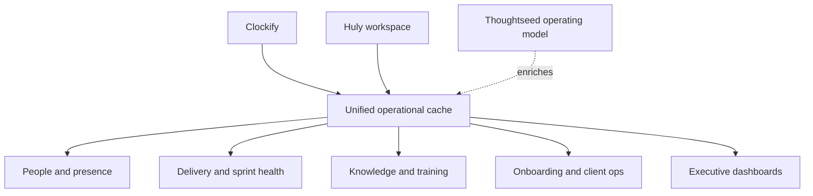
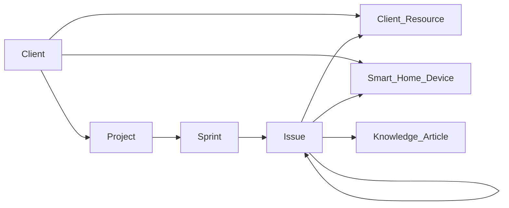
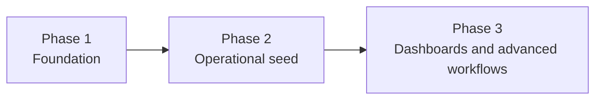

# Thoughtseed Integrated Huly System Design

This document is the source of truth for the Thoughtseed Huly rollout tracked in the repository backlog. It defines the data architecture, operating model, module behavior, and phased migration target for TeamForge and the live Huly workspace.

## Purpose

Thoughtseed needs Huly to behave like an interconnected operating system rather than a loose collection of tracker records. The target state is:

- Clockify answers effort and live activity.
- Huly answers work structure, collaboration, and delivery state.
- Thoughtseed-specific metadata answers client context, sprint context, onboarding context, knowledge lineage, and delivery meaning.

## Current State

As of the April 6, 2026 audit:

- The workspace shell exists: org, people, memberships, baseline tracker projects, default HR objects, docs, board, and channels.
- The target data architecture does not yet exist: enums, classes, tag hierarchies, and relations are still missing.
- Operational modules are present in Huly but mostly unseeded.
- TeamForge UI work has started to reflect the desired operating model, but the backing Huly structure is still incomplete.

## Foundation

### Enums

These enums standardize dropdown values across classes, issues, and operational modules.

| Enum | Values |
| :--- | :----- |
| `project_type` | Smart Home Integration, Energy Management, Web Development, Mobile App, R&D - Consciousness Tech, Creative/VR Experience, AI/ML Development, Internal Operations |
| `client_tier` | Tier 1 - Recurring Revenue (Axtech), Tier 2 - Active Projects (Tuya Partners), Tier 3 - Maintenance Mode (Bezly, Vibrasonix), Tier 4 - One-Off/Ad-hoc, Tier R&D - Innovation Lab |
| `task_complexity` | Quick (<2h), Standard (2-8h), Complex (1-3 days), Epic (3-7 days), Mega (1-4 weeks) |
| `priority_level` | P0 - Critical/Blocking, P1 - High, P2 - Medium, P3 - Low, P4 - Wishlist |
| `work_status` | Backlog, Scheduled, In Progress, Review, Done, Blocked, On Hold |
| `team_role` | Founder/Director, PM-Developer, Senior Developer, Developer, Social Media Manager, Consultant |
| `smart_home_platform` | Tuya IoT Platform, Axtech Energy System, Google Home, Amazon Alexa, Custom Integration, Other |
| `time_off_type` | Vacation, Sick Leave, Remote Work Day, Training/Conference, Public Holiday, Client Meeting (Off-site) |
| `meeting_type` | Daily Standup, Sprint Planning, Sprint Retrospective, Client Call, Team Brainstorm, Training Session, 1-on-1 Sync |

### Classes

These classes act as custom data registries inside Huly.

#### Client

Purpose: master registry for clients, contract context, and operational metadata.

Core fields:

- `name`
- `tier`
- `industry`
- `contract_start`
- `contract_end`
- `primary_contact`
- `contact_email`
- `contact_phone`
- `tech_stack`
- `revenue_model` with values Monthly Retainer, Per-Project, Hourly, Equity, One-Time
- `monthly_value`
- `timezone`
- `google_drive_folder`
- `chrome_profile_name`
- `status` with values Active, On Hold, Completed, Churned
- relations to projects, devices, and resources
- `notes`

#### Smart_Home_Device

Purpose: registry of deployable or supported devices and integrations.

Core fields:

- `device_name`
- `device_model`
- `platform`
- `client`
- `project`
- `device_id`
- `firmware_version`
- `api_endpoint`
- `api_documentation`
- `integration_status` with values Not Started, In Progress, Testing, Deployed, Issue
- `deployment_date`
- `issues`
- `responsible_dev`
- `technical_notes`

#### Client_Resource

Purpose: registry of client systems, credentials, and external service ownership.

Core fields:

- `client`
- `resource_type` with values GitHub Organization, Vercel Account, Cloudflare DNS, Domain Registration, Google Analytics, API Key, Admin Panel, Hosting Account, Database, Other
- `resource_name`
- `url`
- `credentials_location`
- `created_date`
- `created_by`
- `owner`
- `status` with values Active, Deprecated, Migrated, Archived
- `renewal_date`
- `cost`
- `notes`

#### Knowledge_Article

Purpose: durable knowledge base replacing scattered chat and Telegram resource sharing.

Core fields:

- `title`
- `category` with values SOP, Technical Guide, Resource Link, Tool Discovery, Training Material, FAQ, Client Documentation
- `tags`
- `content`
- `author`
- `last_updated`
- relations to projects and tasks
- `external_links`
- `attachments`
- `views_count`

#### Sprint

Purpose: formal iteration object for planning, tracking, demos, and retrospectives.

Core fields:

- `sprint_name`
- `project`
- `start_date`
- `end_date`
- `sprint_goal`
- `planned_capacity`
- `actual_capacity`
- `tasks`
- `completed_tasks_count`
- `total_tasks_count`
- `completion_percentage`
- `retrospective_notes`
- `sprint_demo_date`
- `status` with values Planning, Active, Completed, Cancelled

### Tag Hierarchies

| Hierarchy | Rule | Children |
| :-------- | :--- | :------- |
| `PROJECT_TYPE` | Every task must have exactly one project type tag | Smart Home, Energy Management, Web Development, Mobile App, R&D, VR/AR, Internal |
| `CLIENT` | Every task must have exactly one client tag or `Internal` | Axtech, Tuya variants, Ad-Hoc-Web, Internal |
| `TECH_STACK` | Tasks can have multiple stack tags | React, Vue, Flutter, HTML/CSS, Node.js, Python, Firebase, Custom API, Tuya SDK, Home Assistant, MQTT, Zigbee, OpenAI GPT, TensorFlow, Custom ML |
| `PHASE` | Tasks can have exactly one phase tag | Discovery, Design, Development, Testing, Deployment, Maintenance |

Expected automation behavior:

- Axtech tasks suggest Smart Home and Energy Management.
- Tuya-related tasks suggest Smart Home and Tuya SDK metadata.
- Tech stack tags should suggest relevant knowledge articles.
- Deployment-phase completions should trigger deployment checklists.

### Relations

| Relation | Type | Purpose |
| :------- | :--- | :------ |
| `Blocks` | Issue -> Issue | Critical path and dependency visibility |
| `Relates To` | Issue -> Issue | Context clustering |
| `Duplicates` | Issue -> Issue | Duplicate tracking and closure logic |
| `Creates Resource` | Issue -> Client_Resource | Onboarding outputs and external system creation |
| `Documents In` | Issue -> Knowledge_Article | Documentation lineage |
| `Involves Device` | Issue -> Smart_Home_Device | Device-level debugging context |
| `Part of Sprint` | Issue -> Sprint | Sprint reporting and burndown |
| `Client Assignment` | Project -> Client | Client-level reporting and metadata fan-out |

## Operating Modules

### HR Beta

Target configuration:

- Departments: Engineering, Marketing, Leadership
- Department heads assigned
- Time-off categories mapped to `time_off_type`
- Holidays configured for the operating region
- Team Planner should reflect leave and remote work visibility

Expected outcomes:

- Time off removes capacity from planning.
- Remote work days preserve capacity while changing context.
- Monthly hours can be reviewed from Planner and HR schedule data.

### Tracker

Project structure target:

- Axtech - Smart Home Platform
- Tuya client delivery streams
- Bezly / maintenance streams
- OASIS Development
- New Client Onboarding template
- Thoughtseed Internal Operations

Task naming convention:

`[PROJECT]-[TYPE]-[COMPONENT]-[ID]: Description`

Examples:

- `AXT-FEAT-DEVICE-001: Integrate Tuya smart thermostat`
- `AXT-BUG-API-023: Fix energy data sync error`
- `INT-DOC-PROCESS-001: Document daily standup workflow`

Project codes:

- `AXT`
- `TUY`
- `BZL`
- `VBX`
- `OAS`
- `INT`

Type codes:

- `FEAT`
- `BUG`
- `TASK`
- `DOC`
- `RESEARCH`
- `SETUP`

Required issue metadata:

- assignee
- priority
- work status
- complexity
- project type tag
- client tag
- tech stack tags
- component
- milestone or sprint
- due date
- estimated hours
- relations
- linked client
- linked device
- linked knowledge articles

### Daily Standups

Target behavior:

- End-of-day standups at 6 PM IST
- Developers update tasks and tomorrow's Planner schedule first
- Standup post references completed work, tomorrow's work, blockers, and total time
- PMs review next morning against Team Planner

Required channels:

- `#general`
- `#standups`
- `#axtech`
- `#tuya-clients`
- `#research-rnd`
- `#tech-resources`
- `#blockers-urgent`
- `#training-questions`

### Planner

Target behavior:

- Each team member plans an 8-hour day in Huly Planner
- Planned time is the working source for internal capacity
- Planner visibility supports public, busy-only, and private blocks
- Daily schedule closes with standup posting and next-day planning

### Team Planner

Target PM views:

- Daily and weekly capacity
- overload and under-allocation signals
- blocker visibility
- sprint capacity versus backlog
- client-specific allocation snapshots

### Trainings

Initial tracks:

- Thoughtseed Huly Onboarding
- Smart Home Integration Track
- PM-Developer Track
- R&D Contributor Track
- Tool-specific trainings

Training content should link back to Knowledge_Articles, tasks, and delivery workflows.

### Cards and Dashboards

Dashboard roles:

- Executive dashboard
- PM dashboard
- Developer dashboard

Dashboard themes:

- critical issues
- team capacity
- revenue project status
- blockers
- completed work
- training progress
- knowledge gaps

## Operating Flows

### New Client Onboarding

1. Create the `Client` record.
2. Duplicate the onboarding template project.
3. Auto-attach client tags and metadata to onboarding tasks.
4. As onboarding tasks complete, create `Client_Resource` entries.
5. Archive onboarding project and spin up the delivery project.

### Daily Work Cycle

1. Developer reviews Planner and starts scheduled tasks.
2. Work updates issue status and references knowledge assets and device records.
3. Questions flow through project channels with article or task mentions.
4. End-of-day standup summarizes completed work and schedules tomorrow.
5. PM reviews Planner and standups next morning.

### Sprint Cycle

1. Create `Sprint` record with dates, goal, and capacity.
2. Pull backlog into sprint and estimate by complexity.
3. Assign work against actual team capacity.
4. Use Team Planner and standups to monitor execution.
5. Close with sprint demo and retrospective.

## Implementation Roadmap

### Phase 1: Foundation

Primary issues:

- `#18` Workspace baseline
- `#1` Enums
- `#2` Classes
- `#3` Tag hierarchies
- `#4` Relations
- `#17` Source documentation

Manual execution reference:

- `docs/runbooks/huly-workspace-normalization.md`

### Phase 2: Operational Seed

Primary issues:

- `#19` Sprints, holidays, trainings, knowledge, onboarding template
- `#13` Naming convention
- `#10` Standup workflow
- `#14` Onboarding flow tracking

### Phase 3: Dashboard and TeamForge Depth

Primary issues:

- `#5` Client dashboard
- `#6` Device registry
- `#7` Knowledge base
- `#8` Sprint enhancements
- `#9` Team and HR enhancements
- `#11` Training dashboard
- `#12` Role-based dashboards
- `#15` Planner integration

## Success Metrics

### Month 1

- 100% of active work tracked in Huly rather than Height
- 80% of team members using Planner daily
- daily standups happening in Huly
- one client onboarded from template
- 10 knowledge articles created
- fewer "where is that link?" interruptions

### Month 3

- team capacity planning runs through Team Planner
- all active projects operate from the final project structure
- onboarding time reduced by at least 30%
- tool sprawl reduced toward Huly as the primary operating layer
- standup completion rate above 95%
- internal satisfaction score above 8/10

## Guardrails

- Do not deepen TeamForge UI assumptions before the Huly foundation exists.
- Normalize the live workspace before seeding more records into inconsistent containers.
- Prefer reusable templates, relations, and class records over ad-hoc notes.
- Treat this document as the design contract for all rollout work after v0.1.2.
